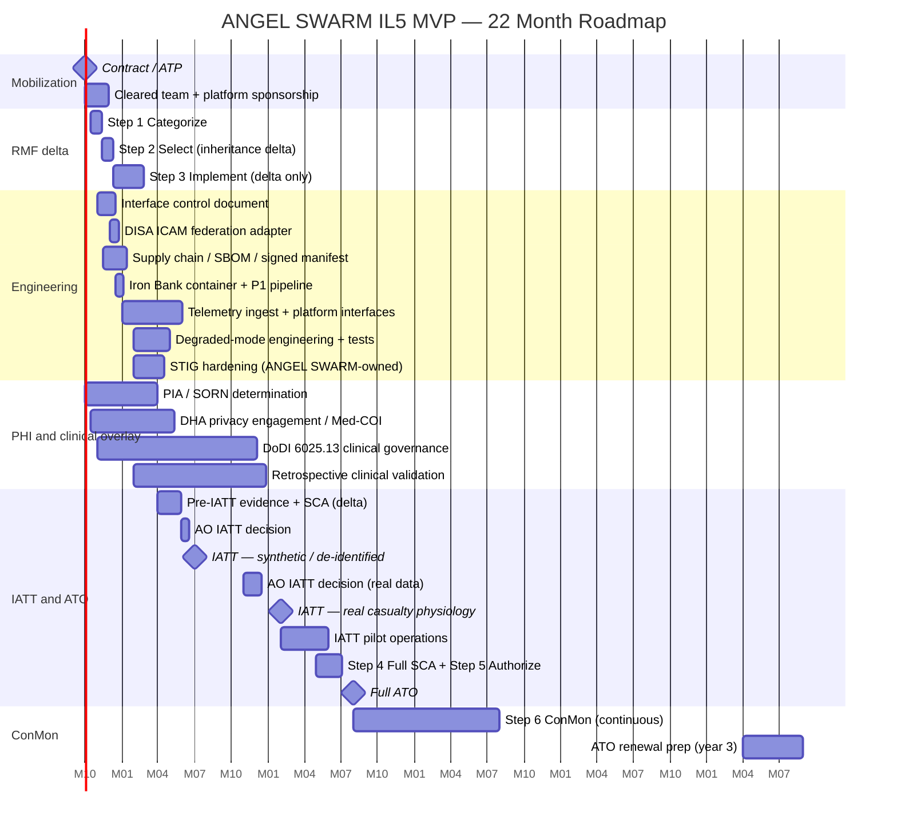

# ANGEL SWARM — DoW IL5 MVP Deployment Cost Impact Analysis

**Prepared for:** DHA / PACOM J4 program leadership, comptroller, and the supporting ISSM
**System:** ANGEL SWARM — autonomous medical resupply tasking against physiological deadlines
**Decision sought:** Go / no-go and budget approval for fielding ANGEL SWARM out of its single-folder prototype configuration into a Department of War (DoW, formerly DoD) Cloud Computing SRG **Impact Level 5 (IL5)** environment as a **Minimally Viable Product (MVP)**, hosted as a capability inside an already-authorised platform, at the lowest defensible cost.
**Document type:** Rough Order of Magnitude (ROM) planning estimate. **Not a bid.** Every dollar figure is a planning range with the driving assumption stated next to it.
**Classification ceiling priced:** Controlled Unclassified Information (CUI), including Protected Health Information (PHI), on **IL5**. IL6 (SIPR / Secret) is explicitly **out of scope**.
**Date of analysis:** August 2026. **Revised against the shipped v6.5 build, 5 September 2026** — every byte size, model count and architecture row below re-checked against the folder as shipped.

---

## MVP scope — what makes this profile different

This prices the **lowest-cost defensible IL5 MVP**, not a program-of-record build. Four levers: three standard, one specific to ANGEL SWARM.

1. **A very small cleared team — 2 to 3 cleared individuals.** One ISSO, one to two cleared engineers; fractional government ISSM oversight; the assessor engaged once for IATT and reused for the full ATO.
2. **DISA ICAM / CAC identity inherited as a sunk cost.** **ANGEL SWARM has no authentication layer today**, so this is a greenfield adapter, not a migration: one OIDC / SAML adapter and a CAC-claim-to-role mapping onto the four shipped role profiles (Commander, Logistician, Surgeon, Analyst).
3. **Host platform inheritance.** ANGEL SWARM fields inside the **War Data Platform** (Advana's successor) or **Maven Smart System**, inheriting the boundary, runtime, identity, SIEM, secrets, encryption, backups, monitoring and the bulk of the NIST SP 800-53 Rev. 5 control set — an **inheritance-delta assessment**, not a full ATO.
4. **No inference spend.** **Two models ship and run locally in the browser, on the CPU already in the endpoint:** a 104,162-parameter 1-D CNN via ONNX Runtime Web and a 22.9 MB int8 sentence encoder. A third path — a small language model via llama.cpp/WebAssembly — has its runtime in the vendored tree but **no weights ship: there is no GGUF in the package and nothing on any screen is generated.** **No AI provider, no API key, no token spend, no GPU, no inference endpoint.**

Levers 1–3 hold cyber and engineering one-time cost to **~$2.1M most likely** against **~$3.6M** for a dedicated DHA IL5 enclave, and pull the first authorisation decision in by roughly a year. Lever 4 makes lines a comptroller expects — GenAI inference, GPU, managed database, tile service — **zero, not small**.

**The counterweight.** The dominant cost is **PHI**: once the tool ingests a real casualty's photoplethysmogram, the DoW Privacy Program, a PIA and DHA clinical governance under DoDI 6025.13 arrive together — **~$1.7M most likely**, and it dominates the schedule.

---

## 1. Executive Summary (read this page only if nothing else)

ANGEL SWARM is a working casualty-tasking decision-support application: a single static Go binary serving an `app/` folder on `127.0.0.1` only, with **no API server, no application server, no database at runtime, no authentication, no session and no user store**, plus **one optional, receive-only telemetry ingest listener that is off by default**. The map runs over geography that ships inside the folder — a **329,624-byte `basemap.json`** plus **223,486 bytes of world coastline and boundary embedded as integer deltas inside `js/theater3d.js`** for the globe scale — with **no tile server and no external tile CDN at any of its four scales**. **Two models** run locally on the CPU; data is synthetic; decisions go to a hash-chained, exportable audit log.

**The architecture is three tiers, and only one belongs to the host platform:** the **edge** monitor on the soldier, the **tactical network** where the tasking decision is made, and the **enterprise** tier — Maven Smart System or the War Data Platform. **Layers, not alternatives.**

| What | Low (ROM) | Most Likely (ROM) | High (ROM) | Notes |
|---|---:|---:|---:|---|
| **One-time cost — cyber and engineering** (integration, telemetry ingest, degraded mode, STIG hardening, RMF inheritance delta, IATT) | **~$1.3M** | **~$2.1M** | **~$3.4M** | §10.1. |
| **One-time cost — PHI and clinical governance overlay** (PIA, SORN, DHA privacy, Med-COI, clinical validation, DoDI 6025.13) | **~$0.9M** | **~$1.7M** | **~$3.0M** | The dominant schedule driver. §10.2. |
| **Total one-time cost** | **~$2.2M** | **~$3.8M** | **~$6.4M** | Sum of the two rows above. |
| **Total annual recurring cost** (cleared sustainment, tenancy, ConMon, fallback kit, clinical sustainment) | **~$0.82M / yr** | **~$1.25M / yr** | **~$2.0M / yr** | **Inference $0. GPU $0. Database $0. Tiles $0.** §10.3. |
| **3-year TCO** | **~$4.3M** | **~$6.9M** | **~$11.3M** | One-time phased over years 1–2, plus recurring. |
| **5-year TCO** | **~$6.0M** | **~$9.5M** | **~$15.4M** | Plus years 4–5 steady state. |
| **Earliest realistic IATT** (synthetic or de-identified physiology) | **~7 months from ATP** | **~9 months** | **~12 months** | Cyber path only, no PHI gate. |
| **Earliest realistic IATT on real casualty physiology** | **~12 months** | **~16 months** | **~22 months** | Gated by privacy and clinical governance. |
| **Earliest realistic full ATO / production fielding** | **~16 months** | **~22 months** | **~30 months** | Inheritance delta, one rework cycle, one quarter of AO queue. |

### Top three risks (one-line each)
1. **PHI and clinical governance start late** — a year later than running them in parallel from month 0. **Mitigation: open the DHA Privacy and Civil Liberties Office and DoDI 6025.13 conversations in month 1.**
2. **The host platform will not accommodate local computation**, so §6.7 cannot be met. **Mitigation: test this in the first sponsorship conversation; it is the one condition under which the enclave in §4.3 becomes correct.**
3. **Single-thread cleared team capacity.** **Mitigation: a cleared integrator with bench depth.**

### One-paragraph recommendation
Field the IL5 MVP **as a hosted capability on the War Data Platform**, whose cross-domain roadmap is also the IL5-to-IL6 pathway; **Maven Smart System is the strong alternate**. **Do not stand up a dedicated DHA IL5 enclave** — it re-introduces roughly $1.5M of build and a year of schedule. Take **DISA ICAM / CAC identity as a sunk-cost inheritance**, **procure no AI capacity**, write the **degraded-mode requirement (§6.7) into the ICD as acceptance criteria on day one**, run a **2–3 person cleared team through a cleared integrator**, and run the **PHI and clinical overlay in parallel from month 0**. **Most-likely budget: $3.8M one-time ($2.1M cyber and engineering + $1.7M PHI and clinical overlay) + $1.25M / yr; 3-year TCO ~$6.9M; 5-year TCO ~$9.5M.** Plan IATT on synthetic data at month 9, IATT on real physiology at month 16, full ATO at month 22.

---

## 2. Current State — what actually has to move

### 2.1 The architecture, layer by layer

Every row is taken from the shipped prototype (`cmd/angelswarm/main.go`, `app/js/`, `app/models/`, `app/data/`, `app/vendor/`).

| Layer | Today | IL5 MVP target | MVP cost lever |
|---|---|---|---|
| **Frontend** | Static HTML / CSS / JS; four map scales (a canvas-2D orthographic globe holding no GPU context, a theatre chart, and deck.gl 2-D and 3-D tactical views), charting, SQL editor and Monte Carlo workbench in Web Workers. | Same code, platform distribution layer. | Inherited. |
| **Basemap** | **`app/data/basemap.json`, 329,624 bytes, in-folder**, plus **223,486 bytes of world coastline (1,380 rings) and international boundary (174 runs) embedded as integer deltas in `app/js/theater3d.js`** for the globe scale — **~553 KB of geography in total. No tile server or CDN at any of the four scales.** | Unchanged. | **Major saving:** a comparable system's $30K–$300K / yr tile line and its swap are **$0**. |
| **Server** | One static **Go binary**, `CGO_ENABLED=0`, four builds, **5.92–6.35 MB each measured on disk**; binds `127.0.0.1` only. **No API server, no application server.** Plus one optional receive-only Cursor on Target UDP ingest listener, off by default. | Hardened Iron Bank container behind the platform ingress; four native builds retained for the disconnected kit. | Packaging, not a rewrite; the listener is the **one** server-side input path (§5). |
| **Database** | **None at runtime. DuckDB-WASM in the browser** over 11 tables. | Unchanged. | **Major saving.** Recurring **$0**; database STIG hours **zero**. |
| **Auth / MFA** | **None. No login, session, user store or accounts.** | **CAC / PIV via DISA ICAM federation, inheriting the PKI ATO (sunk cost)**; the CAC satisfies MFA. | **Major saving — greenfield, not a migration.** |
| **Role profiles** | Four shipped profiles — Commander, Logistician, Surgeon, Analyst. | Same four, bound to CAC claims. | Mapping only. |
| **AI / models** | **Two model files, all local, all CPU**: CRI-Net (**104,162 parameters**, 419,797-byte ONNX, opset 13, input 1×1×500 at 100 Hz); all-MiniLM-L6-v2 (int8, **22,898,176 bytes**, Apache-2.0). An optional SLM path via llama.cpp/WebAssembly has its runtime vendored but **no weights ship — no GGUF is in the package and nothing on any screen is generated by a language model**. | Both unchanged; **the optional SLM runtime removed from the boundary**. | **Major saving — no AI provider, API key, tokens, GPU, inference endpoint or model hosting.** Both **$0**. |
| **Tasking optimiser** | **Deterministic. No weights, nothing learned.** | Unchanged. | No drift monitoring, retraining or model registry. |
| **Data today** | **Synthetic only. No PHI, no PII.** | Real casualty physiology, fleet state, forward stock, launch-point geography at IL5. | **The cost driver of the programme.** §10.2. |
| **Audit** | **Hash-chained decision log**, exportable, **client-side**. | **Authoritative locally**, mirrored to the platform audit store. | Host audit inherited. |
| **Secrets, backups, DR** | **No credential, key or connection string exists**; the application is a folder. | Platform vault; platform backup in the IL5 region. | Inherited. |
| **Network egress / ingress** | **No outbound request originates in the application** — thirteen destinations populated, 0 uncaught page errors, 0 off-origin requests. | Seven versioned data flows (§6.6). | A narrow interface is a cheap boundary argument. |
| **Source & CI/CD** | Local build; four cross-compiled Go targets, vendored JS / WASM tree. | **Platform One / Big Bang on Iron Bank.** | **No commercial CI licence.** |

### 2.2 Regulatory posture — brief, and DoW-first

**ANGEL SWARM is materiel tasking, not a medical device.** It decides which aircraft carries which payload to which grid square, against a deadline. The compensatory-reserve estimate is a sort key inside the optimiser, not a finding surfaced to a clinician, and **a human approves the tasking** through a queue with named escalation grounds.

**The authorities that gate fielding are three, and none is the FDA.** **RMF / ATO** under DoDI 8510.01, priced in §8. **DoDI 6025.13, Medical Quality Assurance and Clinical Quality Management in the MHS** (26 July 2023, Change 1 of 23 May 2025), under which a DHA clinical governance body examines a tool that touches casualty flow. **The DoW Privacy Program** — PIA, SORN determination, minimum-necessary analysis, and a records-retention determination for a log that is itself a PHI repository. Priced in §10.2.

**If a reviewer raises the FDA, two facts.** **DoW is not exempt from FDA medical-device regulation:** Section 716 of the FY2018 NDAA (Public Law 115-91) would have granted an independent emergency-use authority, and was repealed within weeks by **Public Law 115-92 of 12 December 2017**, which preserved FDA's exclusive EUA authority while expanding DoW's determination role under FD&C Act § 564(b). **And an FDA-cleared compensatory-reserve monitor already exists:** De Novo request **DEN160020** for the CipherOx CRI monitor, a Class II adjunctive cardiovascular status indicator at **21 CFR 870.2200, product code PPW**.

---

## 3. Assumptions and exclusions (read this BEFORE the cost tables)

### Assumptions priced in the MVP profile
- **Classification ceiling: CUI, including PHI, on IL5.** Not IL6, not Secret / SIPR.
- **User community: ~150 named users**, ~20 concurrent at peak. Compute is client-side, so concurrency drives endpoint capacity and CAC provisioning, not server cost.
- **Compute location: the endpoint.** The server-side footprint is a telemetry ingest path and a static asset service.
- **Data: pulse waveform at 100 Hz per instrumented casualty**, pseudonymous, plus fleet state, forward Class VIII stock and threat overlay.
- **AI inference: $0** — a structural zero, not a low estimate.
- **Retention: 3-year minimum on the decision log.**
- **DR: RPO 1 hour, RTO 8 hours**, single-region, single-platform.
- **Mission SLA: 99.0%**, with **the tasking core continuing on last-known state when the link drops** (§6.7).
- **Cleared team: 2–3 cleared individuals** through a cleared integrator.
- **Hosting: War Data Platform (recommended) or Maven Smart System**, government-furnished; a tenancy charge-back is assumed, and **no public price was found**.
- **DISA ICAM / CAC PKI treated as a SUNK COST. CI/CD: Platform One / Big Bang on Iron Bank.**
- **The disconnected fallback kit is kept alive and funded.**
- **Schedule starts from ATP with a named sponsor and authorising official in place.**

### Exclusions (explicitly NOT priced in the MVP)
- **IL6 (SIPR / Secret) variant** (§14); **cross-domain solution** between SIPR and NIPR; **SCIF facility costs**.
- **The optional small language model.** Removed from the boundary; the fetch path is deleted.
- **Wearable monitors, casualty detection systems, or resupply airframes.**
- **A prospective clinical trial or field study.** §10.2 prices retrospective validation only.
- **An FDA premarket submission.** §10.2 prices a determination memorandum and, at the high end, a pre-submission.
- **Cross-region DR.** Add ~30–45% to the hosting-adjacent recurring lines.
- **Building the actual SSP, POA&M and eMASS package.**
- **MHS GENESIS integration.**

---

## 4. Hosting — War Data Platform vs. Maven Smart System

Both candidates are IL5-capable, both sit under the Chief Digital and Artificial Intelligence Office, both inherit a substantial fraction of the NIST SP 800-53 Rev. 5 control set down to hosted capabilities, and both are moving toward the classified domain. **Choosing between them is a sponsorship and data-availability question, not a technical one.**

### 4.1 Option A — War Data Platform (Advana's successor). **RECOMMENDED.**

**What you get.** The department's enterprise data and application platform. Its core integration work was awarded to **Accenture Federal Services on the GSA Alliant 2 vehicle, reported at approximately $821.3 million over five years**, integrating **over 700 data sources**. For a hosted capability that means a container runtime, identity federation to DISA ICAM, a SIEM, a secrets store, an audit store, encryption, continuous monitoring — and **the ATO itself**.

**MVP fit.** **The data ANGEL SWARM consumes is exactly what WDP exists to consolidate** — fleet state, forward Class VIII stock by launch point, personnel and logistics.

**Cost characteristics.** **No public price for hosting a capability on WDP was found and none should be invented**; the planning estimate is **$150K–$500K / year, most likely ~$250K**, flagged in §15.

### 4.2 Option B — Maven Smart System

**What you get.** Palantir's Maven Smart System — a live operational user base, an existing authorisation, and an established pattern for hosting third-party analytic capability. **Deputy Secretary Feinberg's memorandum of 9 March 2026 directs its transition to a formal program of record by 30 September 2026**, with roughly two dozen explicit tasks against that deadline.

**MVP fit.** Strong, and better under one condition: **if the sponsoring command needs medical tasking to sit next to the targeting and ISR picture on the same surface.** Tenancy is the same range as Option A, **$150K–$500K / year, most likely ~$250K**.

### 4.3 Option C (NOT recommended for MVP) — stand up a dedicated DHA IL5 enclave

A mission-owner ATO on a DISA-PA'd cloud service offering, behind a Boundary Cloud Access Point, on NIPRNet, with CAC authentication and a CSSP subscription, all built and sustained by the programme. It requires building the entire authentication, authorisation, session and server-side audit layer that **does not exist in ANGEL SWARM today and does not need to on the platform path**, plus BCAP, PKI, DNS and CSSP arrangements and a sustaining security team. **On the same rate basis as §10.1 it costs roughly $3.6M one-time and ~$1.7M / yr against the MVP's $2.1M and $1.25M — about $1.5M more and a year longer to full ATO — and the PHI and clinical overlay in §10.2 is identical either way.**

### 4.4 Recommended baseline: War Data Platform
Most-likely tenancy line **~$250K / year** (estimated; no public source). RMF Implement compressed to the inheritance delta only, ~$260K of cleared labour. Maven Smart System is the alternate at the same planning cost.

---

## 5. STIGs — what applies, with platform inheritance

Most of the STIG burden is **inherited from the host platform**: host OS, network device, Kubernetes and container platform, and the boundary web server requirements. Two rows are worth reading first: the **database STIG line is zero, because there is no database server**, and the **browser STIG line is unusually heavy, because the application *is* the browser workload**.

| STIG | Inherited? | ANGEL SWARM MVP responsibility | One-time hours (Low / ML / High) | Ongoing hours / quarter |
|---|:--:|---|---:|---:|
| Application Security and Development STIG | No | Go static server and browser application; **a materially smaller applicable set than a conventional API tier**. **The one server-side input path is the telemetry ingest parser.** | 160 / 240 / 360 | 12 |
| Web Server SRG | Partial | Evidence the retained Go loopback server and the listener's bind defaults. | 40 / 70 / 110 | 4 |
| Application Server SRG | n/a | **None — no application server exists.** | 0 | 0 |
| Database STIG (any) | n/a | **None — no database server exists.** | **0** | **0** |
| Container Platform SRG / image hardening | **Yes** | Confirm the image rebuilds on Iron Bank base updates. | 24 / 48 / 72 | 4 |
| Kubernetes STIG, Host OS STIG (RHEL 9 / Windows 11), Network Device STIGs | **Yes** | None | 0 | 0 |
| Browser STIG (Google Chrome / Microsoft Edge) | No | **Where ANGEL SWARM's burden sits.** Reconcile WebAssembly, Web Workers, cross-origin isolation and local storage against the STIG'd baseline. | 80 / 140 / 220 | 8 |
| Client-side integrity | No | CSP tightening, subresource integrity, load-time hash verification on both ONNX artefacts and every WASM module, signed asset manifest. | 60 / 110 / 170 | 6 |
| Supply chain — SBOM, SSDF attestation, reproducible build | Partial | **The hard family.** SBOM across the Go binary, every vendored JS and WASM module and both ONNX artefacts; SSDF attestation against NIST SP 800-218; reproducible builds; model cards. | 120 / 200 / 320 | 10 |
| DoW Privacy / PHI handling (engineering share) | Partial | Pseudonymisation enforcement at the ingest boundary with a build-failing test. | 40 / 80 / 140 | 6 |
| **Total** (MVP, with platform inheritance) | | | **~520 / 890 / 1,390 hours one-time** | **~50 hours / quarter = ~200 hrs / year** |

At **$200 / hour** fully-burdened cleared engineering (Low $160 / High $260; anchored to published GSA MAS ceilings of $140–$200/hr for cleared cybersecurity engineering plus a $20–$30/hr TS/SCI premium):
- **One-time STIG hardening: ~$105K (Low) / ~$178K (Most Likely) / ~$278K (High).**
- **Ongoing STIG sustainment: ~$40K / year.**

**Where the hours went.** Roughly a third of the one-time total sits in the supply-chain row, where the residual technical risk of this architecture is concentrated. An assessor who meets unattested WebAssembly binaries at Assess will treat them as unvetted, and that is a rework cycle.

**The new attack surface, named rather than buried.** The telemetry ingest listener is a UDP socket. It is **off unless explicitly enabled**; when enabled it binds **`127.0.0.1` unless a second, separate flag is also passed**; it is **receive-only**; and its input is **bounded**. **Enabling it on a real interface triggers the boundary-protection control family (SC) and should be assessed at that point.**

---

## 6. Dependency and integration work (MVP-trimmed)

ANGEL SWARM has almost nothing to *replace*. It has things to *add*. Several subsections record a **$0** where a comptroller expects a number.

### 6.1 No authentication layer → DISA ICAM federation **(SUNK-COST INHERITANCE, GREENFIELD)**

Federate to **DISA ICAM** for CAC / PIV identity, inheriting PKI, OCSP / CRL, the DoD Root CA chain and the federation issuer as a sunk cost. A system migrating off a commercial identity provider must first unpick an incumbent; **ANGEL SWARM has no incumbent**, so the work is purely additive.
**Effort.** Adapter ~2.5 weeks; claim-to-role mapping ~1 week; ICAM registration and integration test ~1.5 weeks. **~5 engineer-weeks.**
**Cost.** One-time ~**$45K–$90K**, most likely ~**$65K**; recurring **$0**.

### 6.2 AI providers → **there are none. This line is $0.**

CRI-Net and the sentence encoder unchanged; **the optional small language model is removed from the accreditation boundary entirely** — two days of engineering. A comparable system carries a provider authorisation dependency, per-token spend, a workload-identity federation, a model-version treadmill, and usually a self-hosted GPU fallback. **None of it exists here.**
**Cost.** One-time ~**$5K**; recurring **$0 inference, $0 GPU, $0 tokens, $0 model hosting.**

### 6.3 Basemap → **already solved. This line is $0.**

A self-contained GeoJSON / TopoJSON bundle, **`basemap.json`, 329,624 bytes, in-folder**, together with **223,486 bytes of world coastline and international boundary compiled into `js/theater3d.js` as integer deltas** to draw the globe scale — **~553 KB of geography, and no tile server, no tile CDN and no default map host in any code path, at any of the four scales.** The map is a tactical picture over a joint operations area, not a general-purpose basemap. Adding the globe scale in v6.3 and quadrupling its geometry in v6.4 grew `theater3d.js` from 245,079 to 443,996 bytes and **added no request, no asset and no recurring line**.
**Cost.** One-time **$0**; recurring **$0**, against **$30K–$300K / yr** for a live tile service on a comparable system.

### 6.4 Database → **there isn't one. This line is $0.**

DuckDB-WASM in the browser. No managed Postgres, no instance sizing, no PITR window, no connection string to vault, no key lifecycle, no DBA — and, per §5, **no database STIG at all**.
**Effort.** ~1 week to evidence the data-at-rest posture for exported artefacts. **Cost.** One-time ~**$10K**; recurring **$0**.

### 6.5 Static Go binary → hardened container image on the platform runtime

One hardened Linux container on an Iron Bank base, built by a Platform One / Big Bang pipeline emitting a signed image and an SBOM. **The four native builds are retained** for the disconnected kit.
**Effort.** ~3 weeks. **Cost.** One-time ~**$30K–$70K**, most likely ~**$50K**; recurring **$0**.

### 6.6 Synthetic casualty generator → live telemetry ingest and platform data interfaces

**MVP target.** Seven specified, versioned data flows — four in, three out:

| Direction | Content | Source or destination |
|---|---|---|
| **In** | Casualty physiological stream — pulse waveform at 100 Hz, **pseudonymous** | Edge wearable via medic device, forward node, or platform telemetry service |
| **In** | Fleet state — availability, position, fuel, configuration, crew | Platform logistics and operations data |
| **In** | Forward Class VIII stock — blood, plasma, consumables, by launch point | Platform medical logistics data |
| **In** | Threat picture — transit corridors, denied volumes, timing windows | Platform operational picture |
| **Out** | Tasking proposals — airframe, payload, grid, sequence, deadline | Platform tasking or C2 surface, for human approval |
| **Out** | Approvals and refusals, with the escalation ground recorded | Platform record; mirrored locally |
| **Out** | The hash-chained decision log | Platform audit store; **authoritative chain retained locally** |

The casualty stream arrives on the **tactical** tier over a receive-only listener; the other six flows are **enterprise** tier. Four constraints belong in the ICD on day one: **pseudonymous in**; **the optimiser stays inside**; **the decision log is authoritative locally**; **the interface is versioned and narrow**.
**Effort.** ~1.5 FTE-years — ICD authorship, adapters, schema negotiation, integration test.
**Cost.** One-time ~**$250K–$600K**, most likely ~**$390K** (1.5 FTE-yr × $280K); recurring **$0**. **Unchanged by the prototype ingest path**, which does not remove schema negotiation, the six enterprise flows, or validation against a fielded monitor.

### 6.7 The connectivity requirement — degraded-mode engineering **(design constraint, not a caveat)**

**The prototype was never operationally disconnected. It simply had no way for a reading to arrive — and now it does**, on the **tactical** tier. **What this prices is the engineering that makes the *enterprise* dependency survivable.** The requirement, as testable acceptance criteria: **the tasking core continues on last-known state when the platform link drops, degrading to locally-held data rather than failing.**

- A **timestamped local working set** — fleet state, stock picture, threat overlay, casualties already known.
- At link loss the core **does not block, queue or error**; it keeps computing and **marks every element with its age**.
- **Confidence degrades visibly as state ages**, and the approval queue escalates stale-state decisions through the named-escalation-ground mechanism.
- **Locally attached telemetry keeps working**, and **the decision log keeps chaining locally and reconciles on reconnection**.

Built and demonstrated: link state degrades **LIVE → STALE at six seconds → DOWN at fifteen**, and at DOWN the tasking layer carries on with the feed gone.
**Effort.** ~0.5–0.9 FTE-years: the local working-set model, the non-blocking link-loss path, the stale-state escalation ground, chain reconciliation, and a link-loss / reconnect acceptance suite.
**Cost.** One-time ~**$140K–$260K**, most likely ~**$185K**; recurring in the ConMon line.

### 6.8 Client-side decision log → local-authoritative chain mirrored to the platform audit store

The chain stays authoritative locally and is mirrored, because a chain that depends on a network write has a gap every time the link drops. **Effort:** ~3 weeks for the mirror path, reconciliation semantics and divergence surface, plus the records-retention determination.
**Cost.** One-time ~**$30K–$60K**, most likely ~**$45K**; recurring incremental SIEM ingest only (§10.3).

### 6.9 Model and WebAssembly provenance

Signed asset manifest, load-time hash verification, SBOM across the Go binary and every vendored JS and WASM module and both ONNX artefacts, SSDF attestation, re-derivation of the sentence encoder from upstream, model cards. **Priced once, in the §5 supply-chain row.**

### 6.10 Summary table — integration and dependency work (MVP)

| Item | MVP disposition | One-time effort | Recurring delta |
|---|---|---:|---:|
| No auth layer | DISA ICAM adapter + claim-to-role mapping | $45K–$90K | $0 |
| MFA | Satisfied by the CAC | included | $0 |
| **AI provider** | **None exists. Optional SLM removed.** | **$5K** | **$0** |
| **Basemap / tiles** | **~553 KB of geography, in-folder and in-code.** | **$0** | **$0** |
| **Database** | **None exists.** | **$10K** | **$0** |
| Static Go binary | Hardened Iron Bank container | $30K–$70K | $0 |
| Synthetic generator | Live telemetry ingest + platform interfaces | $250K–$600K | $0 |
| **Connectivity requirement** | **Degraded-mode engineering (§6.7)** | **$140K–$260K** | $0 |
| Client-side audit chain | Local-authoritative chain, mirrored | $30K–$60K | see §10.3 |
| Model / WASM provenance | Priced in the §5 supply-chain row | — | — |
| Secrets | Platform vault | $5K | $0 |
| CI/CD | Platform One / Big Bang on Iron Bank | included above | $0 |
| **Total (Low / Most Likely / High)** | | **~$490K / ~$750K / ~$1,190K** | **~$0 / yr** |

---

## 7. Cleared personnel cost model (MVP — 2 to 3 people)

Rates are fully-burdened cleared integrator rates, anchored to published 2026 GSA MAS ceiling ranges for cleared cybersecurity engineering ($140–$200/hr, with a $20–$30/hr TS/SCI premium) at a $170–$200/hr working band across 1,880 productive hours.

| Role | Headcount | Cleared integrator FBR | Annual cost (most likely) | Required clearance |
|---|---:|---:|---:|---|
| **ISSO** — also the assigned ISSE for system-specific controls | 1.0 | $330K | **$330K** | SECRET |
| **Cleared software engineer (lead)** | 1.0 | $280K | **$280K** | SECRET |
| **Cleared software engineer (delivery)** — drops to 0 after full ATO | 1.0 (yrs 1–2) → 0 (yr 3+) | $280K | **$280K** (yrs 1–2) | SECRET |
| **ISSM oversight (government, fractional)** | 0.15 | n/a | **$28K** (loaded, at $185K per government FTE-year) | SECRET |
| **Independent Assessor (SCA)** — engagement-based, re-used | (fixed-fee) | n/a | **$50K–$110K once at IATT, $50K–$110K once at ATO** | SECRET (firm cleared) |
| **Subtotal annual cleared sustainment labour** (build years 1–2) | ~3.15 FTE | | **~$918K / yr** | |
| **Subtotal annual cleared sustainment labour** (steady state, year 3+) | ~2.15 FTE | | **~$638K / yr** | |

### Fully-burdened cleared engineering rate
**$200 / hour** most likely (Low $160 / High $260) for the task-level estimates in §5 and §6. Government staff time is costed at **$185K per FTE-year** (January 2026 GS-13 DC-locality base of $121,785 with an assumed 1.5× fully-loaded factor; **the 1.5× factor is an assumption and is not sourced**).

### Independent Assessor (SCA) — MVP scope
The SCA assesses the **inheritance delta**, not the full Moderate baseline. Against SP 800-53B's 287-control Moderate baseline the delta is a small fraction, because AC, IA, SC, CP, PE, MA and PS are absent by construction or wholly inherited, compressing the fee to **$50K–$110K per engagement**. Anchored to published FedRAMP 3PAO ranges ($30K–$45K Low, $125K–$195K Moderate).

### Single-thread risk and mitigation
- **Contract through a cleared integrator** — bench backfill in days is the reason the MVP can run at this headcount.
- **Cross-train both engineers** on integration, degraded mode, STIG remediation and supply-chain attestation.
- **The ISSO doubles as the ISSE** for the delta.
- **ISSM oversight stays government**, avoiding vendor capture of the security-overseer role.
- **The clinical and privacy work is not on this team.** §10.2 is largely government staff time; assuming the ISSO can absorb it is how this schedule slips.

---

## 8. RMF / ATO walkthrough — what each step costs in the MVP profile

Under DoDI 8510.01, technologies below the system level do not require their own ATO; they complete Assess Only procedures and are inherited into an authorised host's boundary. ANGEL SWARM seeks an **inheritance delta**, and **Step 3 is where the saving lands.**

### Step 1 — Categorize
Moderate / Moderate / Moderate, with the aggregation argument made explicitly: individually a soldier's pulse waveform and a launch point's blood inventory are sensitive; together, in near-real time over a named joint operations area, they describe force disposition and casualty rates. ~3–4 weeks. **Cost:** ~**$30K–$75K**, most likely ~$50K.

### Step 2 — Select (inheritance delta)
Inherit the platform's baseline tailoring, then layer only what ANGEL SWARM retains: application-layer access enforcement, application audit, input validation and the refusal gate, supply chain and artefact integrity, pseudonymisation, and degraded-mode behaviour under CP-10. ~3–5 weeks. **Cost:** ~**$40K–$95K**, most likely ~$65K.

### Step 3 — Implement (the inheritance saving)
Delta only: AC, IA, SC and CP collapse or inherit almost entirely. **2–3 months**, in parallel with the §6 engineering, which is not double-counted here. **Cost:** ~**$180K–$400K**, most likely ~**$260K**.

### Step 4 — Assess (inheritance-delta scope)
The SCA assesses the delta and relies on the platform's evidence for inherited controls; the penetration test is scoped to ingress, seven data flows, container and browser workload, plus **an artefact-integrity assessment of the ONNX and WebAssembly modules**. ~3–4 weeks. **Cost:** ~$50K–$110K SCA + ~$25K programme support + ~$35K–$115K pen test and artefact assessment = ~**$110K–$250K**, most likely ~$165K.

### Step 5 — Authorize
IATT first, full ATO after the pilot; ~3–6 weeks per decision. **Two distinct IATTs are contemplated**: one on synthetic or de-identified physiology, one on real casualty physiology gated by §10.2. **Cost:** ~**$25K–$60K**, most likely ~$40K.

### Step 6 — Monitor (ConMon)
Quarterly STIG re-scan (§5), monthly POA&M burn-down, dependency currency on the vendored WASM and JS tree and the Go toolchain, annual re-test of a delta subset, and **the degraded-mode acceptance suite on every release**. **Cost:** ~**$40K–$120K / year** incremental. 3-year ATO renewal at year 3: ~**$80K–$200K**.

### IATT
The synthetic-data IATT proves the cyber path at month 9 without waiting on the privacy package.

### RMF total (MVP)
- **One-time RMF labour (Steps 1–5):** ~**$385K–$880K**, most likely ~**$580K**.
- **Annual ConMon (Step 6):** ~**$40K–$120K / year**. **3-year ATO renewal:** ~**$80K–$200K**.

---

## 9. Timeline (MVP — months from contract / ATP)

Plain-language milestones:
- **Month 0 (Oct 2026):** ATP, with a named sponsor and AO in place. **The privacy and clinical conversations open in the same month** — the single most important scheduling decision in the plan.
- **Month 1–3:** Host platform sponsorship settled; RMF Categorize and Select against the inheritance delta.
- **Month 1–4:** ICD, ICAM adapter, supply-chain and provenance package, container and pipeline.
- **Month 4–10:** Telemetry ingest and platform interfaces; degraded-mode engineering; STIG hardening.
- **Month 6–9:** Pre-IATT evidence, SCA assessment of the delta, AO decision.
- **Month 9 (Jul 2027):** **IATT on synthetic or de-identified physiology.**
- **Month 8–16:** Privacy package closeout; DoDI 6025.13 engagement; retrospective clinical validation. **Critical path from here.**
- **Month 16 (Feb 2028):** **IATT on real casualty physiology**; pilot operations to month 20.
- **Month 20–22:** Full SCA and AO authorise. **Month 22 (Aug 2028): Full ATO.** **Month 54:** ATO renewal.

The gap between the two IATT milestones — month 9 to month 16 — is privacy and clinical governance, not cyber work.

---

## 10. Cost roll-up (MVP)

All numbers are **planning ROMs** — Low / Most Likely / High.

### 10.1 One-time costs — cyber and engineering

| Category | Low | Most Likely | High | Driving assumption |
|---|---:|---:|---:|---|
| Mobilization (2–3 cleared team via integrator, GFE issue) | $25K | $45K | $75K | Integrator path; team starts day 1. |
| Host platform sponsorship and onboarding | $40K | $90K | $180K | One-time. **No public price found — estimate.** |
| RMF Step 1 — Categorize | $30K | $50K | $75K | M/M/M with the aggregation argument made explicitly. |
| RMF Step 2 — Select (inheritance delta) | $40K | $65K | $95K | Delta only; AC/IA/SC/CP largely collapse or inherit. |
| RMF Step 3 — Implement (control overlay only) | $180K | $260K | $400K | 2–3 months, 2 engineers. Feature engineering priced separately. |
| Integration and dependency engineering (§6.10) | $490K | $750K | $1,190K | Telemetry ingest and degraded mode dominate. **Held despite the prototype's receive-only tactical ingest path** — that removes the acquisition question, not host-schema negotiation, the six enterprise flows, or validation against a fielded monitor, which is where the range sits. **No AI, database or tile line.** |
| STIG hardening on ANGEL SWARM-owned surface (§5) | $105K | $178K | $278K | §5 totals × $200/hr; supply chain is a third of it. |
| RMF Step 4 — SCA (delta) + pen test + artefact-integrity assessment | $110K | $165K | $250K | 3–4 wk SCA, small boundary, unusual artefacts. |
| RMF Step 5 — Authorize support (two IATTs + full ATO) | $25K | $40K | $60K | Three AO decisions. |
| IATT cycle support | $40K | $80K | $140K | 4-month pilot on real data. |
| Documentation: SSP delta, IRP, CP, CM plan, ICD, eMASS package | $60K | $110K | $190K | Most SSP boilerplate flows from the platform. |
| Training (four role profiles, admin, IRP tabletop) | $15K | $30K | $60K | ~150 users + tabletop. |
| Contingency / management reserve (15%) | $175K | $280K | $450K | Standard for IL5. |
| **One-time total — cyber and engineering** | **~$1.3M** | **~$2.1M** | **~$3.4M** | |

### 10.2 One-time costs — the PHI and clinical governance overlay

**This is the dominant cost and the dominant schedule driver, and it has almost nothing to do with cybersecurity.** A casualty's photoplethysmogram, tied to identity, position and clinical state, is Protected Health Information — no less so because the casualty is a service member or the system is offline. HIPAA applies through DoDI 6025.18 and DoDM 6025.18 (effective 13 March 2019); clinical governance applies through DoDI 6025.13.

| Category | Low | Most Likely | High | Driving assumption |
|---|---:|---:|---:|---|
| PIA, Privacy Act / SORN determination, records-retention determination for the decision log | $80K | $120K | $180K | 0.5–0.9 government FTE-yr at $185K plus legal review. **Estimate.** The log is itself a PHI repository once populated. |
| DHA Privacy and Civil Liberties Office engagement, HIPAA minimum-necessary analysis, business-associate instruments | $50K | $80K | $130K | 0.3–0.7 government FTE-yr. **Estimate.** |
| Pseudonymisation enforcement engineering, with a build-failing test | $40K | $70K | $110K | 0.15–0.4 FTE-yr × $280K. **The design decision that most reduces this column:** the optimiser needs a position, a deadline, a receiver-capability code and a duty-role flag — not a name. |
| Med-COI connection engineering and DHA ATO for medical-network integration, if required rather than riding the host platform's path | $150K | $260K | $400K | **Estimate; no public price for Med-COI onboarding was found.** |
| Retrospective clinical validation of the CRI estimator on real de-identified physiology, with IRB, plus DoDI 6025.13 clinical governance engagement | $400K | $850K | $1,500K | **Estimate**, ranging on whether an instrumented waveform corpus exists or must be assembled. **Largest single line in the analysis, and on the critical path.** |
| Regulatory determination memorandum; pre-submission only if the programme produces its own estimator rather than consuming a cleared index | $60K | $120K | $250K | Low end: determination memorandum and legal review. High end assumes a pre-submission is filed. |
| FDA user fee | **$0** | **$0** | **$0** | Verified: 21 U.S.C. § 379j(a)(2)(B)(iii) exempts a Federal Government entity submission absent commercial distribution. |
| Contingency / management reserve (15%) | $117K | $225K | $400K | |
| **One-time total — PHI and clinical overlay** | **~$0.9M** | **~$1.7M** | **~$3.0M** | |

**Read-this clarification.** At the most likely case this overlay is **45% of total one-time cost**. Cyber authorisation proper is roughly **$300K–$350K**, under a sixth of the cyber and engineering column and **under a tenth of the programme total**. **The accreditation is not the expensive part. The medicine is.**

### 10.3 Annual recurring costs

| Category | Low | Most Likely | High | Driving assumption |
|---|---:|---:|---:|---|
| **Cleared sustainment labour** (1× ISSO + 1× engineer + 0.15× government ISSM), steady state | $480K | $640K | $850K | §7. Build years 1–2 run ~$918K with the second engineer. |
| Host platform tenancy / charge-back | $150K | $250K | $500K | §4. **No public price found — pure estimate.** |
| Hosting compute and storage | $0 | $0 | $0 | In tenancy. Server side is an ingest path and a static asset service; compute is on the endpoint. |
| **AI / GenAI inference** | **$0** | **$0** | **$0** | **Structural zero.** Two models on the CPU already in the browser. |
| **GPU capacity** | **$0** | **$0** | **$0** | **None required** — no self-hosted fallback, because there is no hosted primary. |
| **Database** | **$0** | **$0** | **$0** | No database server exists. |
| **Basemap / tile service** | **$0** | **$0** | **$0** | ~553 KB of self-contained geography, in-folder and in-code. |
| Identity (DISA ICAM) | $0 | $0 | $0 | Sunk-cost ATO inherited. |
| CI/CD (Platform One / Big Bang) | $0 | $0 | $0 | Government-furnished, no per-seat licence. |
| ConMon labour beyond the sustainment line | $40K | $70K | $120K | §8 Step 6, incl. degraded-mode suite per release. |
| Annual SCA reassessment (delta subset) | $20K | $40K | $80K | Smaller scope than a standalone system. |
| Scanning, SBOM and artefact-signing tooling | $10K | $18K | $30K | Most tooling on the platform licence. |
| SIEM / audit retention (incremental ingest of the mirrored log) | $5K | $12K | $25K | Inherited service, incremental volume. |
| Backup / DR (platform, single-region) | $0 | $5K | $12K | Inherited. Cross-region excluded. |
| **Disconnected fallback kit sustainment** | $60K | $110K | $180K | §13. Version control across a fleet of kits is the real cost. |
| Clinical governance sustainment (DoDI 6025.13 measurement, event reporting, annual review) | $50K | $100K | $200K | **Estimate.** Recurs while the tool touches casualty flow. |
| **Annual recurring total (MVP)** | **~$0.82M** | **~$1.25M** | **~$2.0M** | |

**Read-this clarification.** **Roughly 70% of the recurring cost is cleared sustainment labour and host-platform tenancy.** Everything a comptroller would normally attack in a cloud bill — inference, GPU, database, tiles, storage — is **zero here, by construction**.

### 10.4 3-year and 5-year TCO (MVP)

Cyber and engineering one-time lands almost entirely in year 1; the PHI overlay splits roughly 60/40 across years 1 and 2.

| Year | Low | Most Likely | High |
|---|---:|---:|---:|
| **Year 1** (cyber/eng one-time + ~60% of the PHI overlay + ~4 months recurring) | $2.2M | $3.6M | $5.9M |
| **Year 2** (remainder of the PHI overlay + full-year recurring at build rate) | $1.2M | $1.9M | $3.2M |
| **Year 3** (steady-state recurring + ATO renewal prep) | $0.90M | $1.4M | $2.2M |
| **Year 4** (recurring + renewal closeout) | $0.87M | $1.32M | $2.1M |
| **Year 5** (steady state recurring) | $0.82M | $1.25M | $2.0M |
| **3-year TCO** | **~$4.3M** | **~$6.9M** | **~$11.3M** |
| **5-year TCO** | **~$6.0M** | **~$9.5M** | **~$15.4M** |

---

## 11. Risk register (MVP-specific)

Likelihood (L) and Impact (I) on a 1–5 scale; risk score = L × I.

| # | Risk | L | I | Score | Mitigation |
|---|---|:-:|:-:|:-:|---|
| 1 | **PHI and clinical governance engaged late.** A DoDI 6025.13 review or privacy determination starting after the engineering is finished adds two to four quarters. | 4 | 5 | 20 | Open both in month 1 on a one-page description of the pseudonymisation design. Fund the overlay as a parallel line. Use the month-9 synthetic-data IATT as the cyber proof point so the halves are not serialised. |
| 2 | **The host platform will not accommodate local computation.** If it requires the tasking computation decomposed into platform services, §6.7 cannot be met and the capability loses its central operational property. | 3 | 5 | 15 | Test in the first sponsorship conversation, not at integration test. Write §6.7 into the ICD as acceptance criteria. A legitimate reason to choose the other host. |
| 3 | **Single-thread cleared team capacity.** Loss of 1 of 3 stops a third of the programme; loss of the ISSO stops authorisation. | 4 | 4 | 16 | Cleared integrator with bench depth — backfill in days. Cross-train both engineers across integration, degraded mode, STIG and supply chain. |
| 4 | **Host-platform dependency.** Release cadence, data model, dependency versions and prioritisation become decisions the programme does not own; if the platform reprioritises, the capability stalls with no independent route to a user. | 4 | 3 | 12 | The accepted cost of the recommended path, stated rather than hidden. Narrow versioned interface (§6.6); fund the disconnected kit as a live fallback rather than letting it lapse. |
| 5 | **PHI scope creep during integration.** Identity entering the tasking layer because it was convenient multiplies the privacy package and pulls in MHS GENESIS-adjacent obligations. | 3 | 5 | 15 | Enforce pseudonymisation as an architectural constraint with a test that fails the build. It is one of the seven flows in §6.6, and where the constraint is held or lost. |
| 6 | **The estimation/tasking boundary is blurred during integration.** Surfacing the estimate on a clinical screen converts a logistics tool into a device-function question. | 3 | 4 | 12 | Enforce the boundary in the ICD, not a memorandum. Consume an already-cleared compensatory-reserve index for the first fielding. |
| 7 | **Supply-chain artefacts cannot be attested.** Non-reproducible WebAssembly modules may be treated by an assessor as unvetted binaries. | 3 | 4 | 12 | Close it in the first 90 days at the §5 supply-chain line. Days of work now; a rework cycle later. |
| 8 | **Clinical validation corpus is not available.** The $850K line assumes a corpus can be obtained; assembling one pushes it to $1.5M and adds two quarters. | 3 | 4 | 12 | Establish corpus availability in the first quarter. De-identified physiology is a much easier conversation than PHI. |
| 9 | **Funding stop-and-start across fiscal years.** The IATT-to-ATO bridge straddles two FY cycles; the PHI overlay straddles three. | 3 | 4 | 12 | Base plus options; pre-fund the clinical validation line in the base period — it is the critical path and least tolerant of a gap. |

---

## 12. Complement, not supplant — what this profile does not have to buy

**The positioning case and the cost case are the same case.** Every zero in §6 and every inheritance line in §4 exists because ANGEL SWARM is an application on infrastructure the Department has already bought, not a system that brings its own.

**No new airframe procurement.** In May 2026 the 44th Medical Brigade, XVIII Airborne Corps, completed an operational validation of autonomous Class VIII aerial resupply using Soaring M25 aircraft. The aircraft are autonomous and fielded. The rule that decides which aircraft flies to which casualty is bought by no program in the portfolio: DIU's AI-Assisted Triage and Treatment Tool (25 February 2026, PROJ00628) states its scope as triage, assessment and documentation and does not buy allocation or tasking of evacuation and resupply assets, and allocation is not a category in TATRC's sixteen-project MEDRAS portfolio of autonomous transport, documentation and treatment. NAVAIR PMA-263 fields the TRV-150 through the Unmanned Logistics Systems–Air line and the Marine Corps TRUAS variant has reached initial operational capability, with automated launch, waypoint navigation, automated landing and payload release. It flies the mission it is given; ANGEL SWARM produces the mission it is given. **This system's airframe parameters are set at or below published performance figures for the TRV-150C, the Soaring M25 and the FVR-90**, so nothing in this document prices an aircraft, and nothing in it assumes a better aircraft than the one that exists.

**No new data environment and no new C2 system — this is why §4.3 is not recommended.** On 9 March 2026 the Deputy Secretary of Defense designated the Maven Smart System a program of record and moved its administration to the CDAO MSS Program Office; the FY27 request funds third-party vendors to develop and field applications on MSS. Open DAGIR's OTA mechanism is the named path by which an outside capability is onboarded to that application layer without owning the data beneath it — and it is the same OTA route §13 already recommends for the engineering half. That is the whole of Option B in §4.2, at the same **~$250K / year** tenancy as the War Data Platform baseline in §4.4. Standing up a dedicated DHA IL5 enclave instead (§4.3) means buying a data environment, an authentication layer, a boundary and a sustaining security team beside ones the Department has already funded for exactly this purpose: **~$3.6M one-time and ~$1.7M / yr against $2.1M and $1.25M — roughly $1.5M more and a year longer to full ATO.**

CDAO's Agent Network, announced June 2026, is architecturally the same object as this system: bounded agents that deliver decision options to a commander in seconds and make no targeting or strike decisions. Its published use cases do not include medical logistics. **ANGEL SWARM is an Agent Network-class capability for the medical lane** — a lane to be filled rather than a program to be displaced, which is a materially cheaper thing to fund than a competitor.

**No new sensing or documentation program.** DIU announced the AI-Assisted Triage and Treatment Tool on 25 February 2026; its stated scope is digital triage, patient assessment and documentation, replacing an analog paper process, and it does not buy allocation or tasking of evacuation and resupply assets. TATRC's MEDRAS portfolio funds autonomous **transport** (including just-in-time whole blood delivery by UAS), autonomous **documentation** and autonomous **treatment** across sixteen projects; allocation is not a category in that portfolio. **§6.6 therefore prices an integration against feeds other programs are already funding, not a sensing program of its own.**

**No new tile or map infrastructure, and no new clinical record.** §6.3 is $0 because ~553 KB of geography ships inside the folder and there is no tile server at any of the four scales. On the clinical side the record of truth already exists: the Operational Medicine Care Delivery Platform, owned by Defense Healthcare Management Systems, integrates with MHS GENESIS, references Joint Trauma System guidance, and is built to run disconnected and intermittent. This system's exported casualty and decision resources are shaped for that lane, and the physiological deadline traces to Joint Trauma System Clinical Practice Guidelines — which is what makes "deadline" a clinical term rather than a product term. **The $1.7M PHI and clinical governance overlay in §10.2 is the cost of entering that lane properly, not the cost of building a parallel one.**

**The regulatory frame follows from the same fact.** DoD Directive 3000.09 (25 January 2023), paragraph 1.1.b, excludes from its applicability *"unarmed platforms, whether remotely operated or operated by onboard personnel, and whether autonomous or semi-autonomous,"* and *"autonomous or semi-autonomous systems that are not weapon systems."* This system tasks unarmed aircraft carrying blood. The Directive excludes it on both counts, in its own words. The rulebook that does apply is DoDI 8510.01 and the Risk Management Framework — which is exactly what §8 prices, and it is why cyber authorisation is under a tenth of the three-year TCO.

### 12.1 What is deliberately NOT claimed

Honest boundaries, stated so no assessor has to find them.

- **CoT is ingested, not emitted.** The telemetry listener is receive-only, off by default, and bound to loopback unless explicitly opened. This system consumes the Cursor on Target feed a joint operations area already produces; it adds a track consumer, not a new interface. An emit path is the obvious next step, is not claimed today, and is **not priced in this document**.
- **The exported health resources are FHIR-shaped, not conformance-tested,** and every exported resource carries that tag. The word "compliant" is not used anywhere. Conformance testing is not in the MVP scope of §3.
- **STANAG 4586 is a target interface, not an implemented one.** It is named as the correct NATO interface for handing an assignment to the control station that already flies the airframe, and nothing more; that hand-off remains an integration item (§6.6), not a delivered capability.
- **No Replicator alignment is claimed.** Replicator 1 and 2 scope is attritable combat autonomy and counter-UAS. Medical logistics is not in either, and claiming the lineage would be an unforced error.
- **No Link 16, VMF or MIL-STD-6017 compatibility is claimed.** Those are platform-to-platform tactical data links for track and fires. A medical-logistics decision layer has no business asserting them — and asserting one would import the classified-operational-context driver that pushes this to IL6 (§14), which this profile does not carry.
- **The allocation mathematics is not claimed as novel.** Published academic work addresses military medical evacuation dispatching and redeployment directly. What is offered here is a fielded decision layer with a provenance record attached to every decision — which is what the published work does not provide.
- **"Swarm" here does not mean attritable strike mass.** It is a fleet of unarmed logistics aircraft carrying blood.

---

## 13. Procurement and recommendation

**Procurement vehicle.** **OTA (Other Transaction Authority)** through DIU, AFWERX or a comparable prototyping vehicle is right for the engineering half. **The PHI and clinical half should not ride the same vehicle:** clinical validation, IRB engagement, privacy determination and DoDI 6025.13 governance are government-staff and specialist-engagement work. Convert the engineering line to a follow-on FAR-based vehicle after the real-physiology IATT.

**Recommendation.**
1. **Host on the War Data Platform**; **Maven Smart System is the strong alternate.**
2. **Do not stand up a dedicated DHA IL5 enclave for the MVP.** ~$1.5M more one-time and a year of schedule.
3. **Federate to DISA ICAM (sunk-cost ATO)** — one adapter, one claim-to-role mapping onto the four existing profiles.
4. **Procure no AI capacity of any kind**, and **remove the optional small language model from the boundary**.
5. **Write the connectivity requirement (§6.7) into the ICD as acceptance criteria on day one.**
6. **Run a 2–3 person cleared team through a cleared integrator**, dropping to 2.15 FTE after full ATO.
7. **Use Platform One / Big Bang on Iron Bank** for CI/CD.
8. **Fund the PHI and clinical governance overlay from month 0, on its own line and vehicle** — 45% of one-time cost and the whole of the schedule risk.
9. **Consume an already-cleared compensatory-reserve index for the first fielding.**
10. **Keep the disconnected fallback kit funded** at ~$110K / yr.
11. **Close the supply-chain and provenance gap in the first 90 days.**
12. **Budget: $3.8M one-time ($2.1M cyber and engineering + $1.7M PHI and clinical overlay) + $1.25M / yr; 3-year TCO ~$6.9M; 5-year TCO ~$9.5M.**
13. **IATT on synthetic data at month 9, IATT on real physiology at month 16, full ATO at month 22, renewal at month 54.**

**Cost of not doing it (one paragraph).** ANGEL SWARM today runs from a folder, on a laptop, with no install, no account, no reachback and no accreditation, which is precisely why a judge, a surgeon or a planner can evaluate it at all. That configuration is not yet the mission: the tactical tier has been exercised against an emitter rather than a fielded monitor, and the enterprise tier does not exist at all. The reference run's finding — 23 dead of survivable wounds against 34 for CURRENT — TRIAGE & PROXIMITY on an identical casualty stream, eleven fewer dead, target zero — is a simulation on synthetic data. **It is a reason to accredit and test the capability, not evidence of clinical effect.** **The MVP profile converts a working demonstration into a deployable capability at ~$6.9M over three years, of which under a tenth is cyber authorisation.**

---

## 14. IL6 / SIPR delta (one paragraph, for context only — not priced)

Moving to IL6 (Secret / SIPR) is driven by the **tasking** side, not the medical side: what pushes ANGEL SWARM to IL6 is consuming the classified air picture, classified threat envelopes or classified scheme-of-manoeuvre data and emitting dispatch orders into a classified C2 network. Note the asymmetry — an IL6 instance can hold the medical data too, so IL6 is not "IL5 plus medical" but "IL5 plus classified operational context." The inheritance pattern still applies and is the main reason to prefer the platform path. **No public unit-price comparison between IL5 and IL6 hosting was found and none should be invented.** The verifiable difference is that IL6 requires a closed SIPRNet enclave, infrastructure physically separated from non-federal and unclassified systems, and operation by cleared US citizens. **A planning judgement, not a sourced figure: a 2×–4× multiplier on hosting and 1.5×–2× on sustaining security staff.**

---

## 15. Citations and sources

### Authoritative DoW / NIST guidance
- **DoD Cloud Computing Security Requirements Guide (SRG).** https://public.cyber.mil/dccs/
- **NIST SP 800-37 Rev. 2 — Risk Management Framework.** https://nvlpubs.nist.gov/nistpubs/SpecialPublications/NIST.SP.800-37r2.pdf
- **NIST SP 800-53 Rev. 5 — Security and Privacy Controls.** https://nvlpubs.nist.gov/nistpubs/SpecialPublications/NIST.SP.800-53r5.pdf
- **NIST SP 800-53B — Control Baselines** (Moderate baseline count used in §7). https://nvlpubs.nist.gov/nistpubs/SpecialPublications/NIST.SP.800-53B.pdf
- **NIST SP 800-218 — Secure Software Development Framework (SSDF).** **DoD Instruction 8500.01 — Cybersecurity.**
- **DoD Instruction 8510.01 — RMF for DoD Systems, 19 July 2022.** https://www.esd.whs.mil/Portals/54/Documents/DD/issuances/dodi/851001p.pdf
- **Continuous Authorization To Operate memorandum, DoD SISO, 4 February 2022.** https://dodcio.defense.gov/Portals/0/Documents/Library/20220204-cATO-memo-Signed-Cleared.pdf

### Medical, privacy and clinical governance authorities
- **DoD Instruction 6025.13 — Medical Quality Assurance and Clinical Quality Management in the MHS, 26 July 2023, Change 1 of 23 May 2025.** https://www.esd.whs.mil/Portals/54/Documents/DD/issuances/dodi/602513p.pdf
- **DoD Instruction 6025.18 — HIPAA.** https://www.esd.whs.mil/Portals/54/Documents/DD/issuances/dodi/602518p.pdf
- **DoD Manual 6025.18 — HIPAA Privacy Rule, effective 13 March 2019.** https://www.esd.whs.mil/Portals/54/Documents/DD/issuances/dodm/602518m.pdf
- **DoD Directive 5136.13 — Defense Health Agency, 30 September 2013.** https://www.esd.whs.mil/Portals/54/Documents/DD/issuances/dodd/513613p.pdf
- **10 U.S.C. § 1073c — Administration of the Defense Health Agency.** https://uscode.house.gov/view.xhtml?req=granuleid%3AUSC-prelim-title10-section1073c&num=0&edition=prelim

### Regulatory posture (§2.2)
- **Public Law 115-92, 12 December 2017 — statutory text, including repeal of the subsection added by section 716 of the FY2018 NDAA (Public Law 115-91).** https://www.congress.gov/115/plaws/publ92/PLAW-115publ92.htm
- **Public Law 115-92: A New Era of Collaboration between DoD and FDA (FDLI).** https://www.fdli.org/2018/08/update-public-law-115-92-a-new-era-of-collaboration-between-dod-and-fda/
- **FDA De Novo DEN160020, CipherOx CRI — 21 CFR 870.2200, product code PPW.** https://www.accessdata.fda.gov/cdrh_docs/pdf16/DEN160020.pdf
- **21 U.S.C. § 379j** (§ 379j(a)(2)(B)(iii) Federal Government entity exemption). https://uscode.house.gov/view.xhtml?req=%28title%3A21+section%3A379j+edition%3Aprelim%29
- **FDA, MDUFA Fees — FY2026.** https://www.fda.gov/industry/fda-user-fee-programs/medical-device-user-fee-amendments-mdufa-fees

### Platform-inheritance references (§4)
- **Post-Advana rebrand, Accenture selected for War Data Platform integration deal (DefenseScoop, 9 July 2026).** https://defensescoop.com/2026/07/09/war-data-platform-integration-accenture-task-order/
- **Core Integration Contract Award for the War Data Platform (DVIDS).** https://www.dvidshub.net/news/570795/department-war-announces-core-integration-contract-award-war-data-platform
- **War Data Platform integration plans under scrutiny (DefenseScoop, 7 August 2026).** https://defensescoop.com/2026/08/07/pentagon-war-data-platform-integration-plans-under-scrutiny/
- **DOD components face 'aggressive' timeline for Maven Smart System transition (DefenseScoop, 15 April 2026).** https://defensescoop.com/2026/04/15/palantir-maven-smart-system-pentagon-program-transition-feinberg/
- **Feinberg's Maven directive (DefenseScoop, 3 April 2026).** https://defensescoop.com/2026/04/03/palantir-maven-feinberg-directive/
- **DISA ICAM** — treated here as a **sunk-cost government-furnished service** with its own ATO. **DISA Iron Bank** (https://repo1.dso.mil/dsop, https://docs-ironbank.dso.mil/overview/) and **Platform One / Big Bang** (https://p1.dso.mil/).

### STIG library (§5)
- **DISA STIG Document Library** — Application Security and Development STIG, Web Server SRG, Application Server SRG, Container Platform SRG, Kubernetes STIG, RHEL 9 STIG, Google Chrome and Microsoft Edge browser STIGs. https://public.cyber.mil/stigs/downloads/
- **Application Security and Development STIG.** https://www.stigviewer.com/stigs/application_security_and_development
- **Container Platform Security Requirements Guide.** https://www.stigviewer.com/stigs/container_platform_security_requirements_guide
- **Google Chrome Current Windows STIG.** https://www.stigviewer.com/stig/google_chrome_current_windows/

### Schedule, assessment-cost and labour anchors
- **Unpacking the Authority to Operate (ATO) Process — Porchia and Finkenstadt, Naval Postgraduate School, May 2025.** https://www.dair.nps.edu/bitstream/123456789/5375/1/SYM-AM-25-342.pdf
- **FedRAMP certification cost by impact level (Paramify, January 2026)** — anchor for the §7 assessor fee range. https://www.paramify.com/blog/fedramp-cost
- **FedRAMP Marketplace.** https://marketplace.fedramp.gov/
- **GSA MAS / IT Schedule labour categories** — anchor for the $200/hr rate in §5–§6 and the FTE-year figures in §7. https://www.gsaadvantage.gov/
- **OPM GS pay tables, January 2026, DC locality** — GS-13 base of $121,785, anchor for the government FTE-year figure in §7.

### System-of-record references for §2.1
- **ANGEL SWARM shipped prototype** — `cmd/angelswarm/main.go` (Go launcher, loopback bind, non-loopback rejection), `cmd/angelswarm/telemetry.go` (optional receive-only CoT/UDP ingest listener, off by default, loopback unless `-cot-external`, 8,192-byte bound), `cmd/cotsim/main.go` (device emitter — not a device driver), `app/js/telemetry.js`, `app/index.html`, `app/js/`, `app/models/ppg_cri.onnx` (419,797 bytes, 104,162 parameters, opset 13, input 1×1×500), `app/models/minilm/minilm.onnx` (22,898,176 bytes, int8, Apache-2.0), `app/data/basemap.json` (329,624 bytes), `app/js/theater3d.js` (443,996 bytes, carrying 223,486 bytes of embedded globe geometry), `app/vendor/` (deck.gl, ONNX Runtime Web, DuckDB-WASM, llama.cpp/WebAssembly runtime with no weights).
- **ANGEL SWARM use case document, v6.5, 5 September 2026** — reference run figures, role profiles, escalation grounds, deployment verification (thirteen destinations populated, 0 uncaught page errors, 0 off-origin requests), and §7.5 for the telemetry ingest tier and the three-tier architecture.

### Estimated lines (no public source)
- **Host platform tenancy / onboarding charge-back** in §4 and §10.3 ($150K–$500K / yr, ~$250K most likely) — **pure estimate. No public price for hosting a capability on the War Data Platform or Maven Smart System was found.** The largest unsourced recurring line here.
- **Host platform sponsorship and onboarding one-time fee** in §10.1 ($40K–$180K) — estimate on the same basis.
- **STIG hours per category** in §5 — professional judgement on comparable IL5 engagements, adjusted down for an architecture with no database server, no application server and no authentication layer, and up for an unusually heavy browser and supply-chain surface.
- **The $200/hour cleared engineering rate and the $330K / $280K FTE-year figures** in §7 — informed by published GSA MAS ceilings; the blend is a judgement.
- **The 1.5× fully-loaded factor on the GS-13 base** to reach $185K per government FTE-year in §7 — **an assumption, not a sourced figure.**
- **RMF step durations and costs** in §8 — the published 6–18 month clustering for a DoW ATO is sourced (Porchia and Finkenstadt); the allocation across steps is judgement.
- **Med-COI connection engineering and DHA ATO** in §10.2 ($150K–$400K) — **estimate; no public price for Med-COI onboarding was found.**
- **Retrospective clinical validation of the estimator** in §10.2 ($400K–$1,500K) — **estimate**, ranging on whether a waveform corpus exists or must be assembled. The largest single unsourced line, and on the critical path.
- **PIA, SORN determination, DHA privacy engagement and clinical governance sustainment** in §10.2 and §10.3 — estimates expressed as fractions of government FTE-years.
- **The dedicated-enclave comparison figures** in §4.3 (~$3.6M one-time, ~$1.7M / yr, ~a year longer to full ATO) — a build-up on the same rate basis as §10.1, not a quoted alternative.
- **The IL6 multipliers** in §14 (2×–4× hosting, 1.5×–2× sustaining security staff) — **a planning judgement, explicitly not a sourced figure.**
- **User community of ~150 named users** in §3 — a planning assumption for an MVP pilot, not a derived requirement.

Every dollar figure in this document is a **ROM planning estimate**, not a bid. Vendor-issued ROMs will refine these numbers ±25% in either direction, and the two largest lines — host platform tenancy and clinical validation — could move further than that once a sponsor and a corpus are identified.

---

_End of analysis._
