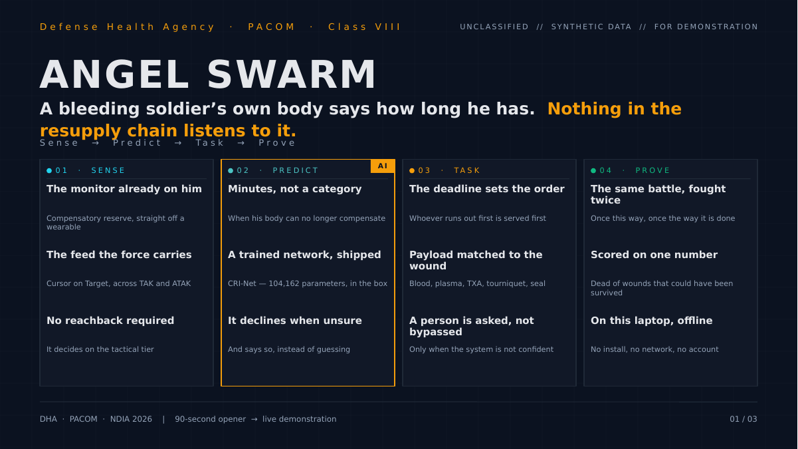
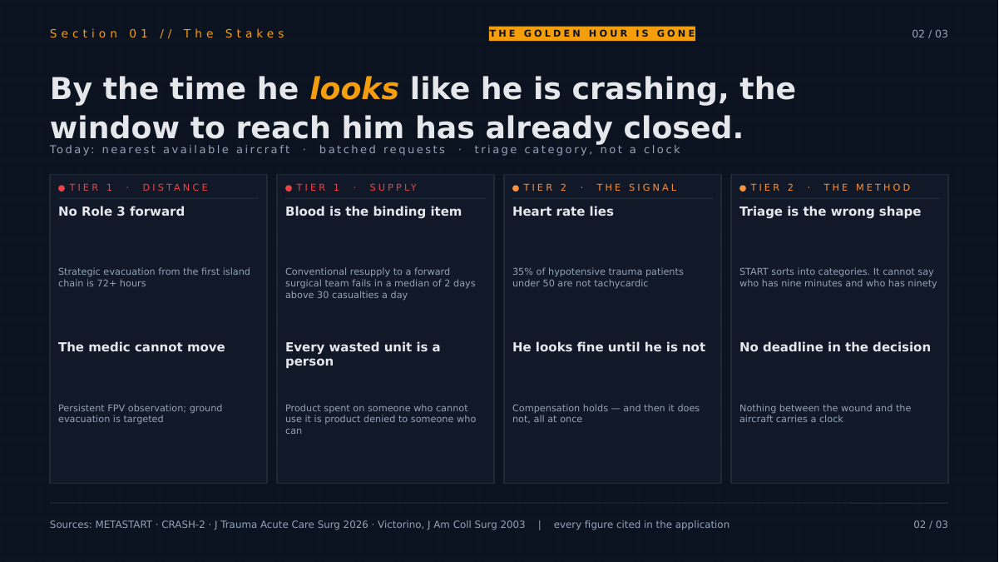
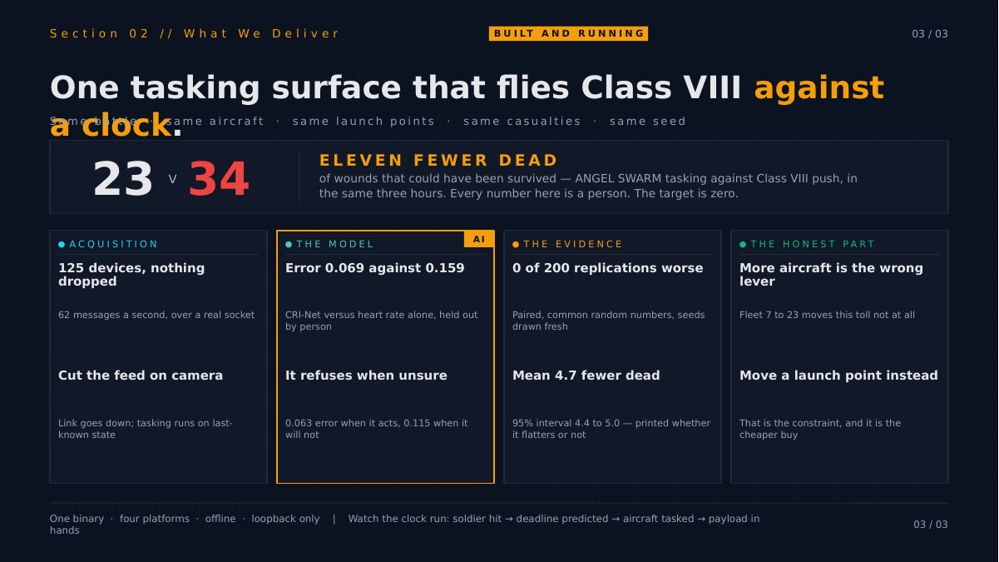

# ANGEL SWARM — Leadership opener

`UNCLASSIFIED // SYNTHETIC DATA // FOR DEMONSTRATION ONLY`

Three slides, cut for a 90-second opening before a live demonstration. Source: [`ANGEL-SWARM-leadership-opener.pptx`](ANGEL-SWARM-leadership-opener.pptx). Defense Health Agency · PACOM · Class VIII.

---

## Slide 1 — Sense → Predict → Task → Prove

> # ANGEL SWARM
>
> A bleeding soldier's own body says how long he has.
> Nothing in the resupply chain listens to it.
>
> **Sense → Predict → Task → Prove**

| | Claim | Detail |
|---|---|---|
| **01 · SENSE** | Prospective monitor input | Sempulse Halo (example); CipherOx CRI M1 (reference) |
| | A plausible producer/interface | BATDOK-J, separate from either monitor; Cursor on Target over TAK / ATAK |
| | No reachback required | It decides on the tactical tier |
| **02 · PREDICT** *(AI)* | Minutes, not a category | When his body can no longer compensate |
| | A trained network, shipped | CRI-Net — 104,162 parameters, in the box |
| | It declines when unsure | And says so, instead of guessing |
| **03 · TASK** | The deadline sets the order | Whoever runs out first is served first |
| | Payload matched to the wound | Blood, plasma, TXA, tourniquet, seal |
| | A person is asked, not bypassed | Only when the system is not confident |
| **04 · PROVE** | The same battle, fought twice | Once this way, once the way it is done |
| | Scored on one number | Dead of wounds that could have been survived |
| | On this laptop, offline | No install, no network, no account |

*The `AI` badge appears against **02 · PREDICT** only. It is the single learned-weights step in the loop, and the deck marks it as such — the same provenance rule the application enforces on screen.*

*Telemetry remains receive-only and off by default, using a prototype CoT `<detail>` dialect rather than a ratified medical schema. ANGEL SWARM has not tested an integration with any real Sempulse Halo, CipherOx CRI M1, or BATDOK-J. No compatibility, military fielding, regulatory status or completed integration is claimed.*

---

## Slide 2 — The stakes

> **Section 01 // The Stakes**
> # THE GOLDEN HOUR IS GONE
>
> By the time he *looks* like he is crashing, the window to reach him has already closed.
>
> Today: nearest available aircraft · batched requests · triage category, not a clock

| Tier | Claim | Detail |
|---|---|---|
| **TIER 1 · DISTANCE** | No Role 3 forward | Strategic evacuation from the first island chain is 72+ hours |
| | The medic cannot move | Persistent FPV observation; ground evacuation is targeted |
| **TIER 1 · SUPPLY** | Blood is the binding item | Conventional resupply to a forward surgical team fails in a median of 2 days above 30 casualties a day |
| | Every wasted unit is a person | Product spent on someone who cannot use it is product denied to someone who can |
| **TIER 2 · THE SIGNAL** | Heart rate lies | 35% of hypotensive trauma patients under 50 are not tachycardic |
| | He looks fine until he is not | Compensation holds — and then it does not, all at once |
| **TIER 2 · THE METHOD** | Triage is the wrong shape | START sorts into categories. It cannot say who has nine minutes and who has ninety |
| | No deadline in the decision | Nothing between the wound and the aircraft carries a clock |

Sources on the slide: METASTART · CRASH-2 · *J Trauma Acute Care Surg* 2026 · Victorino, *J Am Coll Surg* 2003 — every figure cited in the application.

---

## Slide 3 — Built and running

> **Section 02 // What We Deliver**
> # BUILT AND RUNNING
>
> One tasking surface that flies Class VIII *against a clock*.
>
> Same battle · same aircraft · same launch points · same casualties · same seed

**23 v 34** — **eleven fewer dead** of wounds that could have been survived, ANGEL SWARM tasking against Class VIII push, in the same three hours. Every number here is a person. The target is zero.

| Section | Claim | Detail |
|---|---|---|
| **ACQUISITION** | 125 synthetic emitters, nothing dropped | 62 messages a second, over a real socket |
| | Cut the feed on camera | Link goes down; tasking runs on last-known state |
| **THE MODEL** *(AI)* | Error 0.069 against 0.159 | CRI-Net versus heart rate alone, held out by person |
| | It refuses when unsure | 0.063 error when it acts, 0.115 when it will not |
| **THE EVIDENCE** | 0 of 200 replications worse | Paired, common random numbers, seeds drawn fresh |
| | Mean 4.7 fewer dead | 95% interval 4.4 to 5.0 — printed whether it flatters or not |
| **THE HONEST PART** | More aircraft is the wrong lever | Fleet 7 to 23 moves this toll not at all |
| | Move a launch point instead | That is the constraint, and it is the cheaper buy |

One binary · four platforms · offline · loopback only. Watch the clock run: soldier hit → deadline predicted → aircraft tasked → payload in hands.

---

DHA · PACOM · NDIA 2026 — 90-second opener → live demonstration
