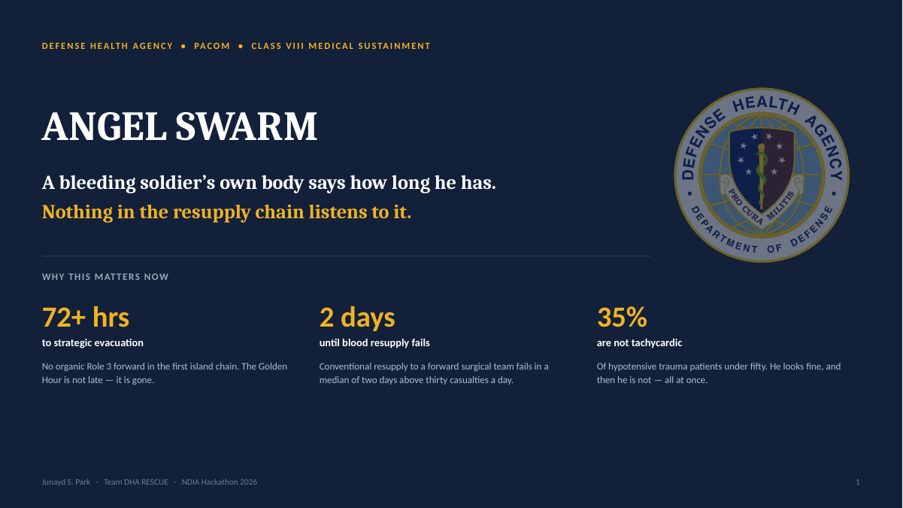
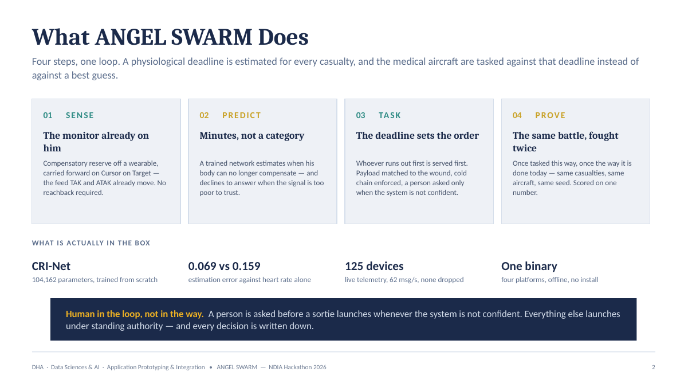
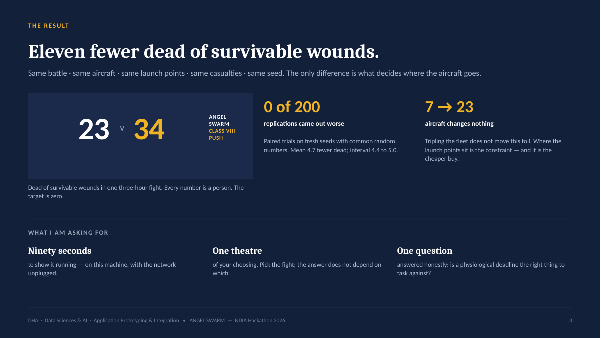

# ANGEL SWARM — Pitch deck

`UNCLASSIFIED // SYNTHETIC DATA // FOR DEMONSTRATION ONLY`

Three slides. Source: [`ANGEL-SWARM-pitch.pptx`](ANGEL-SWARM-pitch.pptx). Junayd S. Park · Team DHA RESCUE · NDIA Hackathon 2026.

---

## Slide 1 — Title and stakes

> DEFENSE HEALTH AGENCY • PACOM • CLASS VIII MEDICAL SUSTAINMENT
>
> # ANGEL SWARM
>
> **A bleeding soldier's own body says how long he has.**
> **Nothing in the resupply chain listens to it.**

**Why this matters now**

| Figure | Claim | Detail |
|---|---|---|
| **72+ hrs** | to strategic evacuation | No organic Role 3 forward in the first island chain. The Golden Hour is not late — it is gone. |
| **2 days** | until blood resupply fails | Conventional resupply to a forward surgical team fails in a median of two days above thirty casualties a day. |
| **35%** | are not tachycardic | Of hypotensive trauma patients under fifty. He looks fine, and then he is not — all at once. |

---

## Slide 2 — What ANGEL SWARM does

> Four steps, one loop. A physiological deadline is estimated for every casualty, and the medical aircraft are tasked against that deadline instead of against a best guess.

| | Step | Claim | Detail |
|---|---|---|---|
| **01** | SENSE | A prospective monitor input | Sempulse Halo (example); CipherOx CRI M1 (reference). BATDOK-J is a separate plausible producer/interface for Cursor on Target. |
| **02** | PREDICT | Minutes, not a category | A trained network estimates when his body can no longer compensate — and declines to answer when the signal is too poor to trust. |
| **03** | TASK | The deadline sets the order | Whoever runs out first is served first. Payload matched to the wound, cold chain enforced, a person asked only when the system is not confident. |
| **04** | PROVE | The same battle, fought twice | Once tasked this way, once the way it is done today — same casualties, same aircraft, same seed. Scored on one number. |

**What is actually in the box**

| | |
|---|---|
| **CRI-Net** | 104,162 parameters, trained from scratch |
| **0.069 vs 0.159** | estimation error against heart rate alone |
| **125 synthetic emitters** | live telemetry, 62 msg/s, none dropped |
| **One binary** | four platforms, offline, no install |

> **Human in the loop, not in the way.** A person is asked before a sortie launches whenever the system is not confident. Everything else launches under standing authority — and every decision is written down.

*Telemetry caveat: the prototype listener is receive-only and off by default, and accepts a prototype CoT `<detail>` dialect rather than a ratified medical schema. ANGEL SWARM has not tested an integration with any real Sempulse Halo, CipherOx CRI M1, or BATDOK-J. No compatibility, military fielding, regulatory status or completed integration is claimed.*

---

## Slide 3 — The result

> ## THE RESULT
> ### Eleven fewer dead of survivable wounds.
>
> Same battle · same aircraft · same launch points · same casualties · same seed. The only difference is what decides where the aircraft goes.

**23** (ANGEL SWARM) **v** **34** (Class VIII push) — dead of survivable wounds in one three-hour fight. Every number is a person. The target is zero.

| Figure | Claim | Detail |
|---|---|---|
| **0 of 200** | replications came out worse | Paired trials on fresh seeds with common random numbers. Mean 4.7 fewer dead; interval 4.4 to 5.0. |
| **7 → 23** | aircraft changes nothing | Tripling the fleet does not move this toll. Where the launch points sit is the constraint — and it is the cheaper buy. |

**What I am asking for**

- **Ninety seconds** — to show it running, on this machine, with the network unplugged.
- **One theatre** of your choosing. Pick the fight; the answer does not depend on which.
- **One question** answered honestly: is a physiological deadline the right thing to task against?

---

DHA · Data Sciences & AI · Application Prototyping & Integration • ANGEL SWARM — NDIA Hackathon 2026
