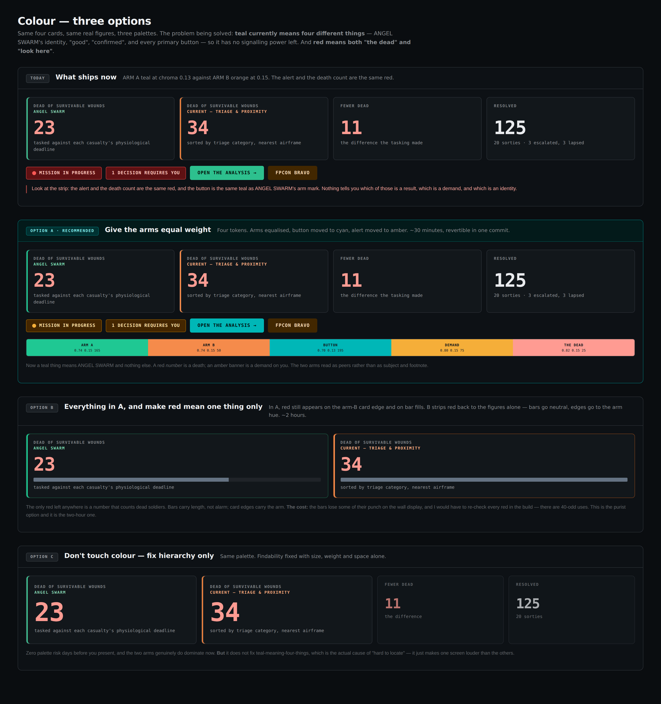

# ANGEL SWARM — Design Decisions

`UNCLASSIFIED // SYNTHETIC DATA // FOR DEMONSTRATION ONLY`

Four design questions were put up as rendered mockups rather than as a
written proposal, reviewed, and decided. The mockups are kept here because
the decision is only legible next to the thing that was rejected.

Every mockup uses the application's real design tokens, its real IBM Plex
fonts and its real figures, so what is pictured is what would have shipped.

---

## `colour.png` — three palette options, and what ships today

The problem: teal meant four different things at once (ANGEL SWARM's
identity, "good", "confirmed", and every primary button) so it had no
signalling power left, and red meant both "the dead" and "look here".

**DECIDED:** option C — change no colour at all. Findability was fixed with
size, weight and spacing instead. Verified afterwards by diffing every colour
literal in the file: 480 distinct values before, 480 after, none added, none
removed.

Full write-up: [colour.md](colour.md)

---

## `narrative.png` — four options for where the comparison goes

Four options for where the ANGEL-vs-CURRENT comparison should appear. The
problem, in the operator's words: "I didn't have a direct KPI comparing
ANGEL SWARM against the current state," so the comparison had to be spoken
from memory.

**DECIDED:** N1, N2 and N3 together — pair the figure wherever it stood
alone, put one comparison line under every screen title, and carry both tolls
on the navigation rail permanently. N4, a guided walkthrough, was argued
against and then adopted on the operator's reasoning; it ships OFF by
default.

Full write-up: [narrative.md](narrative.md)

---

## `port.png` — two ideas ported from a team member's concept

Two ideas ported from a team member's concept, drawn onto a real screenshot
of this application in the position and at the size they would occupy.

**DECIDED:** both. The route-stage strip ships with one addition the operator
asked for — it highlights the stage the sortie is actually on.

Full write-up: [port.md](port.md)

---

## `theatre_fix.png` — the theatre map, diagnosed

The theatre map, diagnosed. Left is what shipped; right is the same 243
coastline runs and 31 international boundary runs already in `app/js/geo.js`,
redrawn with the projection, contrast, boundary weight and labelling fixed.

**DECIDED:** all four defects fixed, and a GLOBE scale added alongside.

Full write-up: [theatre.md](theatre.md)

---

## The one thing that was not taken

And why it matters more than what was: the team member's map is Mapbox GL
Standard Satellite at 40 degrees pitch with dusk lighting and 3D terrain,
served from `api.mapbox.com` against a paid access token. It is genuinely
impressive and it is unreproducible offline by construction. Adopting it
would have traded away the zero-off-origin-request property that every
regression run asserts and that the security and ATO document is built on.
This application's answer to a satellite basemap is `app/js/basemap.js` —
procedural shaded relief with real contours, computed from the scenario's own
elevation field, which renders identically with the network cable pulled.

---

The `.html` files are the mockup sources and open in any browser, offline.
