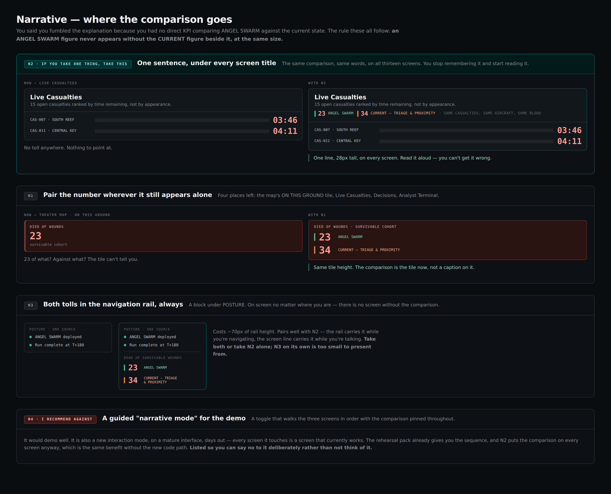

# Narrative — where the comparison goes

`UNCLASSIFIED // SYNTHETIC DATA // FOR DEMONSTRATION ONLY`

Source: [`narrative.html`](narrative.html) · Render: [`narrative.png`](narrative.png)

## The question put up

The operator had no direct KPI comparing ANGEL SWARM against the current
state, so the comparison had to be spoken from memory and was fumbled. The
mockup states the problem and the rule it holds every option to:

> You said you fumbled the explanation because you had no direct KPI
> comparing ANGEL SWARM against the current state. The rule these all follow:
> **an ANGEL SWARM figure never appears without the CURRENT figure beside it,
> at the same size.**

## What the mockup shows

Four options, N1 to N4, three of them shown as before-and-after pairs against
the live screens. The comparison figures are constant throughout: **23** for
ANGEL SWARM against **34** for `CURRENT — TRIAGE & PROXIMITY`, teal and
orange arm markers, red numerals.

N2 is presented first because it is the recommendation.

### `N2 · IF YOU TAKE ONE THING, TAKE THIS` — One sentence, under every screen title

"The same comparison, same words, on all thirteen screens. You stop
remembering it and start reading it."

The pair shows the Live Casualties screen — "15 open casualties ranked by
time remaining, not by appearance", with rows `CAS-007 · SOUTH REEF` at
`03:46` and `CAS-011 · CENTRAL KEY` at `04:11`. On the left, headed `NOW —
LIVE CASUALTIES`, there is nothing else; the caption reads "No toll anywhere.
Nothing to point at." On the right, a comparison line sits directly under the
subtitle: `23 ANGEL SWARM`, `34 CURRENT — TRIAGE & PROXIMITY`, followed by the
qualifier `· SAME CASUALTIES, SAME AIRCRAFT, SAME BLOOD`. Its caption: "One
line, 28px tall, on every screen. Read it aloud — you can't get it wrong."

### `N1` — Pair the number wherever it still appears alone

"Four places left: the map's ON THIS GROUND tile, Live Casualties, Decisions,
Analyst Terminal."

The pair uses the theater map's `ON THIS GROUND` tile. Left, headed `NOW —
THEATER MAP · ON THIS GROUND`, is a single red tile: `DIED OF WOUNDS`, `23`,
"survivable cohort", captioned "23 of what? Against what? The tile can't tell
you." Right, the tile is relabelled `DIED OF WOUNDS · SURVIVABLE COHORT` and
carries both rows — `23 ANGEL SWARM` and `34 CURRENT — TRIAGE & PROXIMITY` —
at the same numeral size. Caption: "Same tile height. The comparison is the
tile now, not a caption on it."

### `N3` — Both tolls in the navigation rail, always

"A block under POSTURE. On screen no matter where you are — there is no
screen without the comparison."

Two rails side by side. Both carry `POSTURE · ONE SOURCE` with "ANGEL SWARM
deployed" and "Run complete at T+180". The right-hand rail adds a divider, the
heading `DEAD OF SURVIVABLE WOUNDS`, and the two tolls at 19px. The note gives
the cost and the dependency: "Costs ~70px of rail height. Pairs well with N2 —
the rail carries it while you're navigating, the screen line carries it while
you're talking. **Take both or take N2 alone; N3 on its own is too small to
present from.**"

### `N4 · I RECOMMEND AGAINST` — A guided "narrative mode" for the demo

"A toggle that walks the three screens in order with the comparison pinned
throughout." N4 is the only option shown as argument alone, with no mockup:

> It would demo well. It is also a new interaction mode, on a mature
> interface, days out — every screen it touches is a screen that currently
> works. The rehearsal pack already gives you the sequence, and N2 puts the
> comparison on every screen anyway, which is the same benefit without the new
> code path. **Listed so you can say no to it deliberately rather than not
> think of it.**

## The decision

**N1, N2 and N3 together** — pair the figure wherever it stood alone, put one
comparison line under every screen title, and carry both tolls on the
navigation rail permanently. That is the full recommended set, including the
N2-plus-N3 pairing the mockup argues for.

**N4 was adopted anyway.** The mockup tags it `I RECOMMEND AGAINST` and lists
it expressly so it could be refused deliberately. It was argued against, then
adopted on the operator's reasoning, and it ships **OFF by default** — so the
mature interface is unchanged unless the toggle is thrown.
