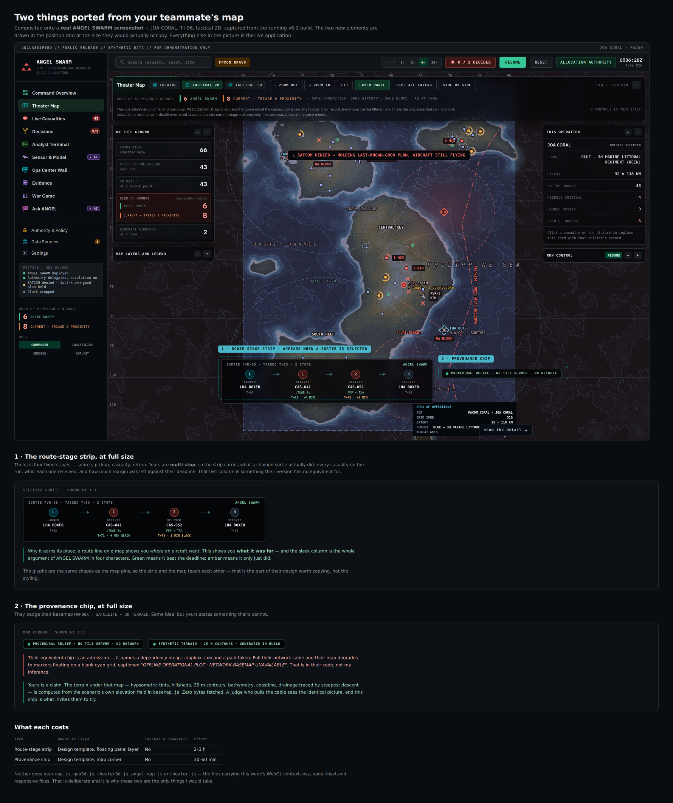

# Port — two ideas taken from the team member's map

`UNCLASSIFIED // SYNTHETIC DATA // FOR DEMONSTRATION ONLY`

Source: [`port.html`](port.html) · Render: [`port.png`](port.png)

## The question put up

A team member's concept map contained ideas worth having. Which of them can be
taken without taking the dependency that makes that map work, and without
going near the files carrying this week's fixes? The mockup answers by drawing
the candidates onto the real application:

> Composited onto a **real ANGEL SWARM screenshot** — JOA CORAL, T+96,
> tactical 2D, captured from the running v6.2 build. The two new elements are
> drawn in the position and at the size they would actually occupy. Everything
> else in the picture is the live application.

## What the mockup shows

The composite is a full-width screenshot (`map_real.png`) with two overlays
drawn on it in dashed cyan call-out boxes, each labelled: `1 · ROUTE-STAGE
STRIP — APPEARS WHEN A SORTIE IS SELECTED`, floating across the bottom of the
map between the panel columns, and `2 · PROVENANCE CHIP`, above the area of
operations block. Each is then shown again at 1:1 underneath.

### 1 · The route-stage strip

> Theirs is four fixed stages — source, pickup, casualty, return. Yours are
> **multi-stop**, so the strip carries what a chained sortie actually did:
> every casualty on the run, what each one received, and how much margin was
> left against their deadline. That last column is something their version has
> no equivalent for.

The worked example is `SORTIE FVR-05 · TASKED T+63 · 2 STOPS`, badged `ANGEL
SWARM`, laid out as four legs joined by arrows:

| Glyph | Stage | Node | Payload | Timing |
|---|---|---|---|---|
| `L` | `LAUNCH` | `LHA BOXER` | — | `T+63` |
| `1` | `DELIVER` | `CAS-041` | `LTOWB 2u` | `T+71 · 4 MIN SLACK` (green) |
| `2` | `DELIVER` | `CAS-052` | `FDP + TXA` | `T+78 · 1 MIN SLACK` (amber) |
| `R` | `RECOVER` | `LHA BOXER` | — | `T+91` |

In the composited version, at map scale, the slack column is abbreviated to
`T+71 · +4 MIN` and `T+78 · +1 MIN`.

The argument for it:

> Why it earns its place: a route line on a map shows you *where* an aircraft
> went. This shows you **what it was for** — and the slack column is the whole
> argument of ANGEL SWARM in four characters. Green means it beat the
> deadline; amber means it only just did.

And, on why it is the design and not the styling that is being copied: "The
glyphs are the same shapes as the map pins, so the strip and the map teach
each other — that is the part of their design worth copying, not the styling."

### 2 · The provenance chip

They badge their basemap `MAPBOX · SATELLITE + 3D TERRAIN`. Two chips are
shown in reply, both teal-bordered: `PROCEDURAL RELIEF · NO TILE SERVER · NO
NETWORK` and `SYNTHETIC TERRAIN · 25 M CONTOURS · GENERATED IN BUILD`.

The contrast is stated as the point of the whole exercise:

> Their equivalent chip is an admission — it names a dependency on
> `api.mapbox.com` and a paid token. Pull their network cable and their map
> degrades to markers floating on a blank cyan grid, captioned *"OFFLINE
> OPERATIONAL PLOT · NETWORK BASEMAP UNAVAILABLE"*. That is in their code, not
> my inference.

> Yours is a claim. The terrain under that map — hypsometric tints, hillshade,
> 25 m contours, bathymetry, coastline, drainage traced by steepest descent —
> is computed from the scenario's own elevation field in `basemap.js`. Zero
> bytes fetched. A judge who pulls the cable sees the identical picture, and
> this chip is what invites them to try.

### What each costs

| Item | Where it lives | Touches a renderer? | Effort |
|---|---|---|---|
| Route-stage strip | Design template, floating panel layer | No | 2–3 h |
| Provenance chip | Design template, map corner | No | 30–60 min |

Closing note: "Neither goes near `map.js`, `geo3d.js`, `theater3d.js`,
`angel-map.js` or `theater.js` — the files carrying this week's WebGL
context-loss, panel-inset and responsive fixes. That is deliberate and it is
why these two are the only things I would take."

## The decision

**Both.** The route-stage strip ships with one addition the operator asked for
— it highlights the stage the sortie is actually on. That highlight is not in
the mockup: the HTML draws all four legs at equal emphasis, distinguishing them
only by glyph colour (`L` cyan, the two delivery stops red, `R` neutral grey)
and by slack colour. The current-stage highlight was added on top of what is
pictured here.

What was *not* taken is recorded in [README.md](README.md): the Mapbox GL
Standard Satellite basemap itself, which cannot be reproduced offline and would
have cost the zero-off-origin-request property the regression suite asserts.
