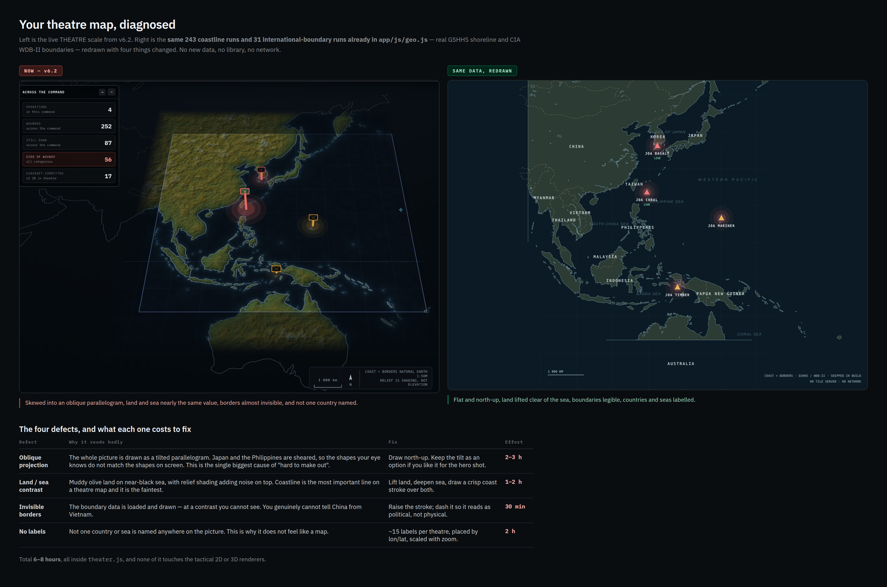

# Theatre — the map, diagnosed

`UNCLASSIFIED // SYNTHETIC DATA // FOR DEMONSTRATION ONLY`

Source: [`theatre.html`](theatre.html) · Renders: [`theatre_fix.png`](theatre_fix.png), [`theatre_crop.png`](theatre_crop.png)

## The question put up

The shipped THEATRE scale was reported as hard to make out. Was that a data
problem, a library problem, or a drawing problem? The mockup answers by
redrawing the identical data with nothing added:

> Left is the live THEATRE scale from v6.2. Right is the **same 243 coastline
> runs and 31 international-boundary runs already in `app/js/geo.js`** — real
> GSHHS shoreline and CIA WDB-II boundaries — redrawn with four things
> changed. No new data, no library, no network.

## What the mockup shows

A two-column comparison. The left column, tagged `NOW — v6.2`, is a crop of
the shipped map (`theatre_crop.png`), captioned:

> Skewed into an oblique parallelogram, land and sea nearly the same value,
> borders almost invisible, and not one country named.

The right column, tagged `SAME DATA, REDRAWN`, is not an image but a live
`<canvas>`: the page loads `../app/js/geo.js` and redraws `GEO.PACOM` in the
browser, so the "fixed" side is generated from the shipped data at view time.
Its caption:

> Flat and north-up, land lifted clear of the sea, boundaries legible,
> countries and seas labelled.

The redraw is a plate carrée with a cosine correction at a standard parallel of
12°, spanning 95°–160° E and 32° S–52° N. Land is filled and then given a
crisp coast stroke over the top; international boundaries are dashed so they
read as political rather than physical. Twelve country labels are placed by
lon/lat — `CHINA`, `JAPAN`, `KOREA`, `PHILIPPINES`, `INDONESIA`, `AUSTRALIA`,
`VIETNAM`, `TAIWAN`, `PAPUA NEW GUINEA`, `THAILAND`, `MALAYSIA`, `MYANMAR` —
alongside six sea labels: `PHILIPPINE SEA`, `SOUTH CHINA SEA`, `CORAL SEA`,
`SEA OF JAPAN`, `BANDA SEA` and `WESTERN PACIFIC`. Four operations are plotted
as haloed triangles — `JOA CORAL` and `JOA BASALT` in red and marked `LIVE`,
`JOA MARINER` and `JOA TIMBER` in amber — with a 1 000 km scale bar and two
lines of corner furniture: `COAST + BORDERS · GSHHS / WDB-II · SHIPPED IN
BUILD` and `NO TILE SERVER · NO NETWORK`.

### The four defects, and what each one costs to fix

| Defect | Why it reads badly | Fix | Effort |
|---|---|---|---|
| **Oblique projection** | The whole picture is drawn as a tilted parallelogram. Japan and the Philippines are sheared, so the shapes your eye knows do not match the shapes on screen. This is the single biggest cause of "hard to make out". | Draw north-up. Keep the tilt as an option if you like it for the hero shot. | 2–3 h |
| **Land / sea contrast** | Muddy olive land on near-black sea, with relief shading adding noise on top. Coastline is the most important line on a theatre map and it is the faintest. | Lift land, deepen sea, draw a crisp coast stroke over both. | 1–2 h |
| **Invisible borders** | The boundary data is loaded and drawn — at a contrast you cannot see. You genuinely cannot tell China from Vietnam. | Raise the stroke; dash it so it reads as political, not physical. | 30 min |
| **No labels** | Not one country or sea is named anywhere on the picture. This is why it does not feel like a map. | ~15 labels per theatre, placed by lon/lat, scaled with zoom. | 2 h |

Total **6–8 hours**, all inside `theater.js`, and none of it touches the
tactical 2D or 3D renderers.

## The decision

**All four defects fixed, and a GLOBE scale added alongside.**

The four fixes are exactly what the mockup demonstrates and costs. The GLOBE
scale is not in the mockup: `theatre.html` shows only the THEATRE scale, at one
zoom level, and neither draws nor prices a globe view. It was added as a
separate scale beside the corrected theatre map, not as one of the four fixes.

The value of the diagnosis is that it rules out the expensive answers. The
right-hand picture is drawn from `app/js/geo.js` as shipped, in the browser,
with no tile server and no network — so the defect was never the data or the
absence of a mapping library. It was how the data was being drawn.
