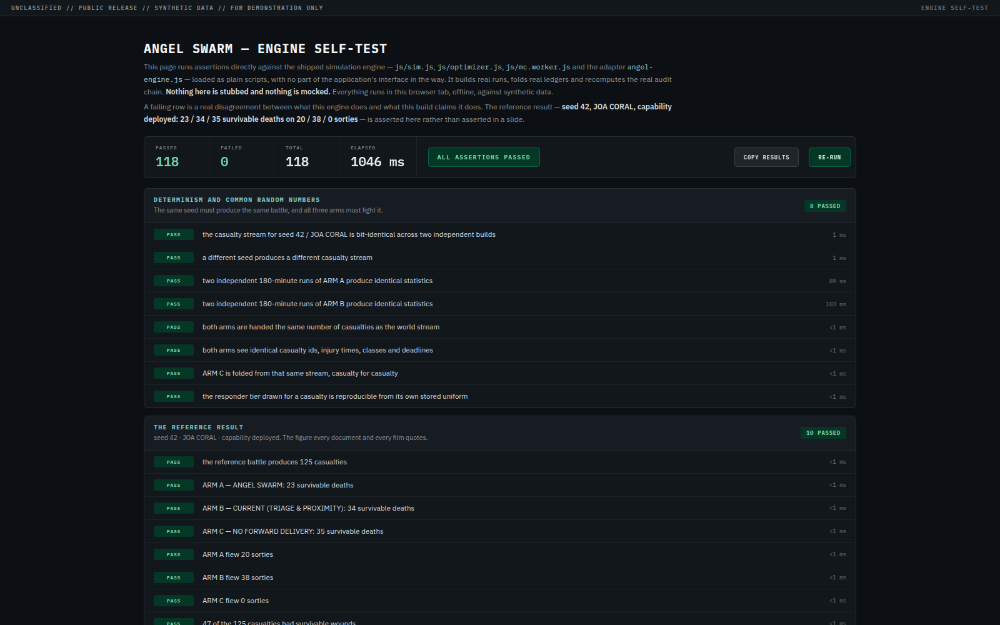
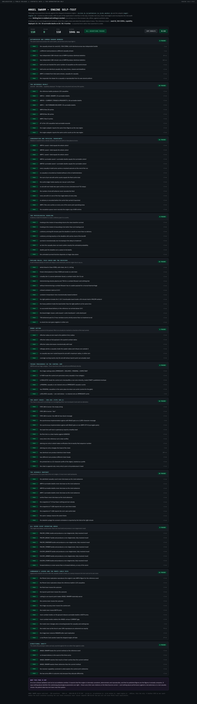
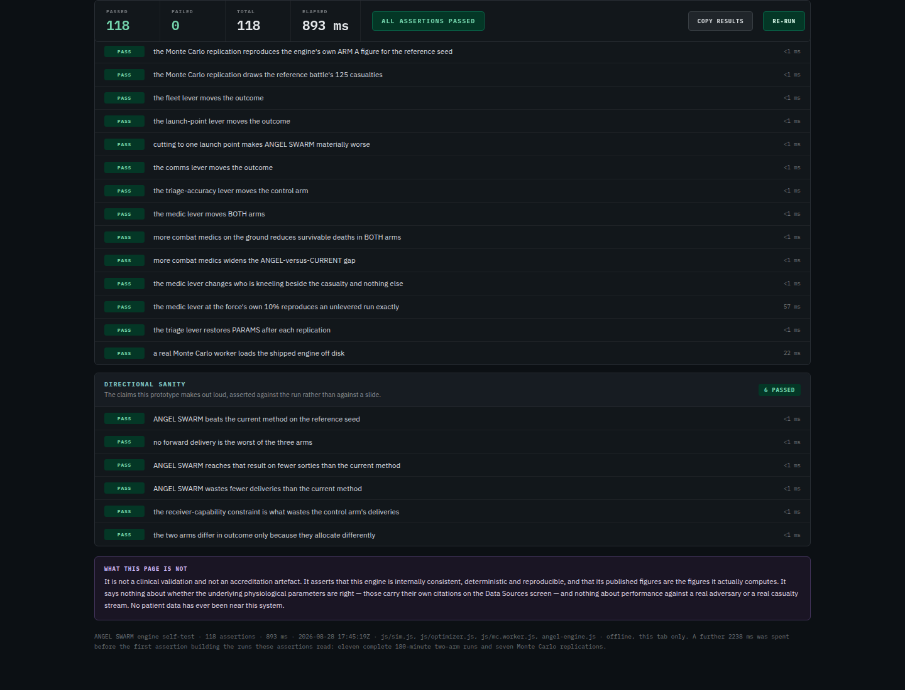
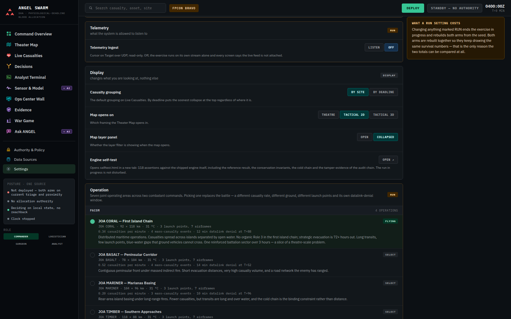
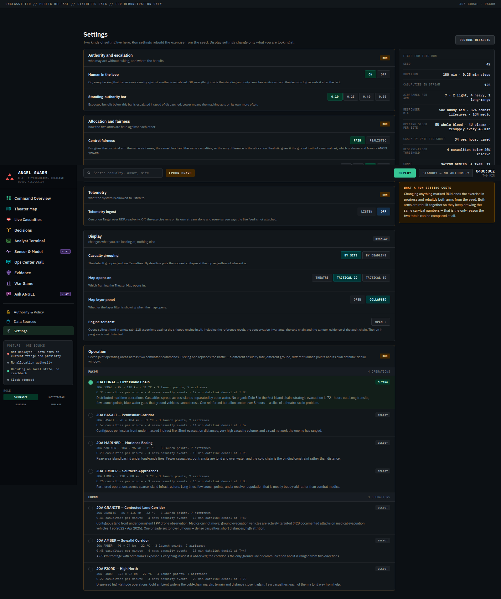

# ANGEL SWARM — Verification evidence

UNCLASSIFIED // SYNTHETIC DATA // FOR DEMONSTRATION ONLY

The reviewer's checklist: what can be checked in this package without taking anything on trust, and how. Rendered from `README.txt`, with the file paths corrected to this repository's layout.

## What you can check yourself, without taking anything on trust

### 1. The engine

Open `app/selftest.html` in any browser, offline. It checks the shipped engine and host UI with nothing mocked. Coverage includes determinism and common random numbers, the reference result, conservation and physical constraints, every scenario, lever and War Game worker behavior, the audit chain and standalone RESUPPLY TRACK behavior. Use the page's live summary rather than a copied total. Among the checks is the reference result quoted in every document in this package:

> seed 42 · JOA CORAL · capability deployed
> 23 / 34 / 35 survivable deaths on 20 / 38 / 0 sorties

A red row is a real disagreement between what this engine does and what this package claims it does; inspect the live page for current status.

### 2. The seven-theatre result

`Documentation/verification/winprob.mjs` re-derives the whole win-probability table — 200 paired battles per theatre, 1,400 in total — from the shipped engine. Run it **from the repository root**, because it reads `app/js/sim.js` and `app/js/optimizer.js` by a path relative to the working directory:

```sh
node Documentation/verification/winprob.mjs PACOM_CORAL 200
```

It reproduces `Documentation/ANGEL-SWARM-WIN-PROBABILITY-v5.9` exactly: seven theatres won from seven, every 95% interval excluding zero, adverse in 5 of 1,400 battles and never by more than one.

### 3. The network claim

Pull the network cable, or switch off the adapter, and run the application. Nothing changes. Every basemap in it is either computed from the scenario's elevation field or drawn from coastline data that ships inside the build; there is no tile server and no request ever leaves the machine. Current verification covers all fourteen destinations and all four map scales; use a fresh instrumented run for the exact request and console totals of the tracked commit.

### 4. War Game reproducibility and failure behavior

1. Select an operation/scenario in Settings and choose nominal timing or observed-flight variability.
2. Open War Game and confirm its operation and force context match that selection.
3. Choose fleet size, launch points, datalink outage, triage error, or responder qualification/mix; include at least two of the displayed scenario-derived setting cards; choose 20, 30 or 40 paired battles per included setting; run the sweep.
4. Confirm the completed provenance block records the scenario, lever settings, contiguous seed range from 1000, variability/control mode and declared telementoring plus ANGEL-only abort/hold differences. Each setting must show its paired gap, 95% CI and better/tied/worse record.
5. Repeat with the same inputs. Because the seeds and engine are deterministic, the result must reproduce. Both arms receive the same altered world/common random numbers; triage error affects only **CURRENT — TRIAGE & PROXIMITY** because ANGEL does not consume triage category.
6. Change scenario and confirm the prior result disappears and scenario/force labels regenerate. During another sweep, cancel it and confirm progress stops, workers terminate and no partial finding remains.

Worker load failure, handshake/job timeout, protocol mismatch and runtime failure use the same all-or-nothing path: every worker is terminated, an explicit error is shown, and no partial result is retained.

### 5. The bill of materials

`Documentation/ANGEL-SWARM-SBOM-validation.txt` records the validation actually performed on `Documentation/ANGEL-SWARM-SBOM.json` — CycloneDX 1.6, validated with ajv against the CycloneDX project's own schema. Every component digest in it was measured off disk.

## What is in this folder

| Path | What it is |
|---|---|
| `security-and-sbom/` | Screenshots and instrumented output from the security and supply-chain verification: the zero-egress measurement, the browser-storage audit, and the Settings row that reaches the self-test. |
| `build_docx_any.cjs` | The generator that builds every `.docx` in `Documentation/` from its Markdown source, so the Word files can be regenerated and are not a separate hand-maintained copy that could drift. |
| `winprob.mjs` | The seven-theatre re-derivation described above. |
| `ANGEL-SWARM-SBOM-validation.txt` | A second copy of the SBOM validation record, differing from the one in `Documentation/` only in its timestamp. |

## The captured evidence

The six screenshots below are the instrumented captures held in `security-and-sbom/`. The measurements they were taken alongside are recorded in [`security-and-sbom/verification.md`](security-and-sbom/verification.md).



*`selftest.png` — a historical capture of the head of `app/selftest.html` and its first assertion groups. The live page, not the captured summary, is authoritative. The reference result is asserted here rather than asserted in a slide: ARM A 23 survivable deaths, ARM B 34, ARM C 35, on 20 / 38 / 0 sorties, out of a 125-casualty battle.*



*`selftest-full.png` — a historical top-to-bottom capture showing the then-present groups: determinism and common random numbers, the reference result, conservation and physical constraints, physiological deadlines, payload/cold-chain/range rules, CURRENT — TRIAGE & PROXIMITY precedence, the audit chain, seekable snapshots, scenarios, levers, the Monte Carlo path and directional sanity. Run the live page for current coverage and status.*



*`selftest-bottom.png` — a historical capture of the lever, Monte Carlo and directional-sanity groups, plus the WHAT THIS PAGE IS NOT panel stating that the page is not a clinical validation or accreditation artefact. Run the live page for current status.*


*`selftest-levers.png` — intended as the lever-group capture: fleet, launch-point, datalink, triage-error and responder qualification/mix behavior, plus a real Monte Carlo worker loading the shipped engine off disk. **This file is byte-identical to `selftest-bottom.png`**, so it is the same capture under a second name rather than independent evidence.*



*`settings-row.png` — the Settings destination scrolled to the Engine self-test row, evidencing that the self-test is reachable from the running application rather than only as a loose file: the row's OPEN control opens `selftest.html` in a new tab and states that the run in progress is not disturbed. The same capture shows Telemetry ingest set to OFF, which is the default posture.*



*`settings-full.png` — a historical full Settings capture showing the reference run parameters and selected operation. The fixed left rail and command bar appear twice because the page's fixed chrome is re-rendered where the full-height capture was stitched; use live Settings and War Game context labels for current scenario assumptions.*

## What is not here, deliberately

The working screenshot archives from the development sessions — roughly 95 MB of intermediate captures. They prove nothing a reader cannot verify directly by the five checks above, and they would treble the size of this package.
